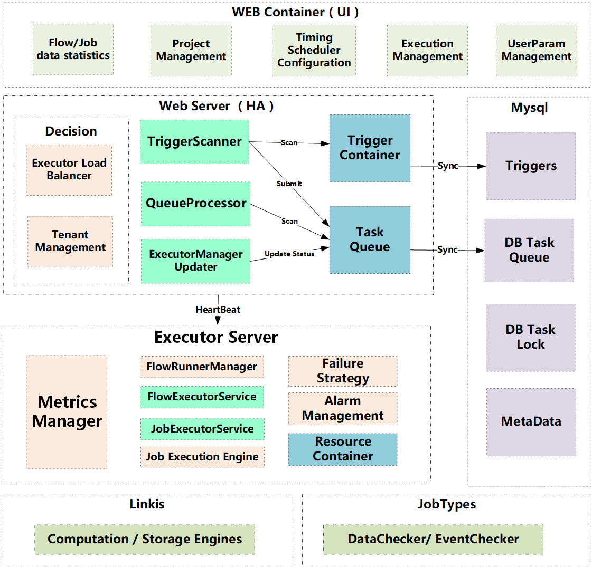

# 简介

Schedulis 是一个基于 LinkedIn 的开源项目 [Azkaban](https://github.com/azkaban/azkaban) 开发的工作流任务调度系统。该调度系统具备高性能，高可用（去中心化多调度中心和多执行器）和多租户资源隔离等金融级特性；现已被集成到数据应用开发门户 [DataSphere Studio](https://github.com/WeBankFinTech/DataSphereStudio)。   

Schedulis 支持常规的 Command Shell 和 Linkis（HadoopMR、 Hive、Spark、Sqoop、 Python）大数据任务；同时还支持特色的数据检查和工作流之间的依赖任务；支持完善的告警和工作流执行策略；提供多种类型的参数设置，动态全局变量和简单易用的 UI。

# 与 DataSphere Studio 和 Linkis 的对接
DataSphere Studio 可以将编辑好的工作流一键发布到 Schedulis 进行调度，而 Schedulis 也实现了 Linkis 插件，用于向 Linkis 提交任务，这样使得 Schedulis 与 DataSphere Studio 和 Linkis 能够无缝衔接，从而实现数据应用开发全流程的连贯顺滑用户体验。

# 与业界现有调度系统的比较
下面将 Schedulis 和业界现有的调度系统做了个对比，包括：Azkaban， Airflow 和 Xxl-job

| 模块 | 描述 | Schedulis | Azkaban  | Airflow | Xxl-job |
| :----: | :----: |-------|-------|-------|-------|  
| HA | 调度中心高可用 | 支持 | 不支持  | 不支持 | 支持 |
| 资源管理 | 执行节点多租户 | 支持  | 不支持 | 不支持 | 不支持 |
| 运行视图 | 工作流结构图（DAG） | 清晰显示任务状态，任务类型，工作流状态，重试次数等关键信息 | 只显示工作流和任务状态 | 只显示任务状态 | 只显示任务状态 |
| WeDataSphere整合 | 对DataSphere Studio和Linkis的支持 | 与DSS和Linkis无缝对接 | 不支持  | 不支持 | 不支持 |
| 特色功能 | 循环执行 | 支持 | 不支持  | 不支持 | 不支持 |
|  | 灵活的工作流参数 | 支持不同级别多种设置方式的工作流参数 | 不支持 | 不支持 | 不支持 |
|  | hive表数据到达检查 | 支持 | 不支持  | 不支持 | 不支持 |
|  | 工作流之间交互依赖 | 支持 | 不支持  | 不支持 | 不支持 |
|  | 失败策略 | 
支持任务失败暂停、跳过、重试、超时处理 | 
不支持失败策略 | 
支持部分任务重跑策略 | 
支持任务超时处理和失败重试 |
| 系统管理 | 用户管理 | 支持 | 不支持  | 支持 | 不支持 |

# 界面预览

# 架构设计

[DSS工程发布到调度系统的架构设计](https://github.com/WeBankFinTech/DataSphereStudio/blob/master/docs/zh_CN/ch4/DSS%E5%B7%A5%E7%A8%8B%E5%8F%91%E5%B8%83%E8%B0%83%E5%BA%A6%E7%B3%BB%E7%BB%9F%E6%9E%B6%E6%9E%84%E8%AE%BE%E8%AE%A1.md)

# 文档列表

[Schedulis 环境部署文档](./docs/schedulis_deploy_cn.md)    

[Schedulis 用户使用手册](./docs/schedulis_user_manual_cn.md)

[Schedulis AppConn 插件安装](https://github.com/WeBankFinTech/DataSphereStudio-Doc/blob/main/zh_CN/%E5%AE%89%E8%A3%85%E9%83%A8%E7%BD%B2/SchedulisAppConn%E6%8F%92%E4%BB%B6%E5%AE%89%E8%A3%85%E6%96%87%E6%A1%A3.md)

[Schedulis 版本升级手册](./docs/schedulis_upgrade_manual_cn.md)

# Communication

如果您想得到最快的响应，请给我们提 issue，或者扫码进群：

# License

Schedulis is under the Apache 2.0 License. See the [License](./LICENSE) file for details.
