# 1 简介

Schedulis 是一个批量任务调度系统，其中的任务指的是大数据领域数据开发过程中的 ETL 任务，包括常规的 Command Shell 和 Linkis （HadoopMR、 Hive、Spark、Sqoop、 Python）大数据任务，还包括特色的 DataChecker（数据到达检查任务） 和 EventChecker（工作流之间的依赖任务） 的任务类型。   
Schedulis 通过灵活的配置可以自由的组织工作流，可以支持工作流立即执行、定时调度、循环执行、同一工作流的并发执行和工作流的条件执行等多种任务调度方式。

# 2 特色

## 2.1 简单易用的 UI

系统采用 B/S 架构，提供了简单易用的 UI，包括血缘图、表格、图表等常用的组件 UI。

## 2.2 支持多种 ETL 任务

支持常规的 Command Shell 和 Linkis （HadoopMR、 Hive、Spark、Sqoop、 Python）等大数据任务，同时还支持特色的数据到达检查任务 DataChecker 和 工作流之间的依赖任务 EventChecker。   

## 2.3 支持灵活的调度方式

支持工作流立即执行、定时调度、循环执行和条件执行等多种任务调度方式。

## 2.4 完善的告警机制

支持任务失败或者任务完成触发告警，支持多级别细颗粒度的告警，和监控系统打通，支持邮件、电话、短信等多种方式通知相关人员。

## 2.5 支持工作流的并发执行

对于同一工作流，支持并发执行，例如在一个工作流的上一次提交未执行完成时，可以重新触发该工作流的新一次提交，使其并发执行。

## 2.6 支持HA模式

支持开启多台WebServer节点，节点之间数据可以正确同步，单台 WebServer 停止服务，不影响工作流执行。

# 3 与 DataSphere Studio 和 Linkis 的对接
DataSphere Studio 可以将编辑好的工作流一键发布到 Schedulis 进行调度，而 Schedulis 也实现了 Linkis 插件，用于向 Linkis 提交任务，这样使得 Schedulis 与 DataSphere Studio 和 Linkis 能够无缝衔接，从而实现数据应用开发全流程的连贯顺滑用户体验。

# 4 功能模块简介

## 4.1 登录页

 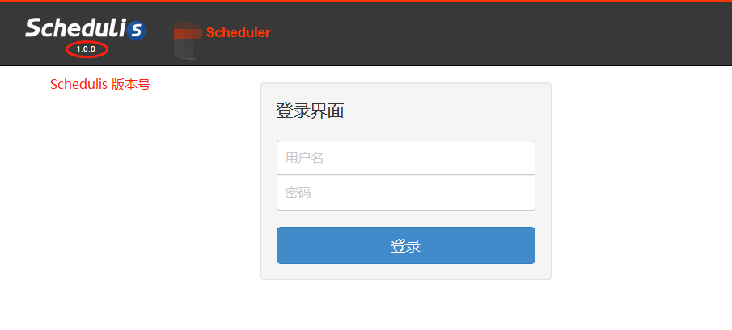

登录页的左上角包含 Schedulis 的 Logo 和 Schedulis 的版本号，在登录表单中填写用户名和密码。

## 4.2 首页

 

登录 Schedulis 之后点击导航栏首页选项即可进入首页，首页包含三块信息：今日工作流整体状态（统计图表）、今日工作流整体状态（详情表格）和异常工作流实时信息。

### 4.2.1 今日工作流整体状态（统计图表）

 

该统计图表支持动态式与用户交互：用户将鼠标光标放到其中一块工作流状态区域，该统计图表可以动态地为用户显示相应工作流状态的数目和占所有工作流的百分比。

### 4.2.2 今日工作流整体状态（详情表格）

 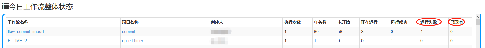

该详情表格为用户列出了工作流的今日状态基本信息，譬如：运行成功数目和运行失败数目等。

### 4.2.3 异常工作流实时信息

 

该实时信息表为用户列出了一些工作流的非手动异常信息，包括：KILLED，FAILED 和 FAILED_FINISHING

## 4.3 项目页

项目由工作流集合组成，对项目的操作其实就是对其底下工作流的操作。

 

项目页包含快速查找（根据项目名，描述，创建用户包含）、项目名排序、新建项目和项目列表四个部分。项目列表又分为个人项目列表和所有项目列表。

### 4.3.1 项目工具栏

 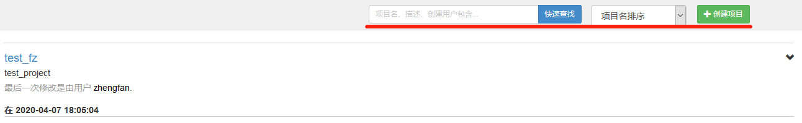
 

### 4.3.2个人项目

 

### 4.3.3 所有项目

 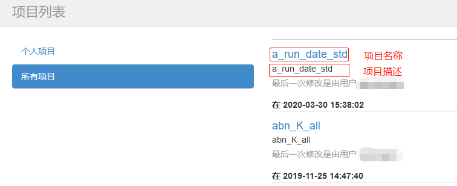

该所有项目列表将登陆用户所拥有可读权限的所有项目全部列出。

### 4.3.4 最近删除


最近删除列表将会展示用户最近删除的项目。

- 列表中的项目支持恢复与下载，不支持修改
- 无法删除已经调度的工作流对应的项目
- 删除项目后，项目对应的调度配置将会失效
- 列表中的项目默认保留30天
- 在该列表中删除项目则为彻底删除，无法恢复

### 4.3.5 项目交接


用户可在项目页勾选项目并在项目交接弹窗中选择新用户，提交后生成 ITSM 服务请求单

- 只有项目管理员才可以发起项目交接
- 审批链：被交接人、交接人、交接人室经理
- 审批过程中表单内容不能更改
- 可自定义项目交接的需求描述。

### 4.3.5 高级过滤


支持根据任务名和项目名等找到所属项目。

## 4.4 调度管理页


调度管理页包含两个 tag —— 定时调度与信号调度。

### 4.4.1 定时调度

定时调度页包含定时调度工作流列表，列表中展示的信息包含工作流 ID、工作流名称、所属项目、提交人、调度配置修改时间、下一次执行时间、Cron 表达式、工作流是否有效、是否设置告警等信息。提供快速查找（根据工作流名称、所属项目名称或提交人）、按列排序、显示参数、删除调度、设置告警和调度配置等操作。


- 参数：以 JSON 字符串方式显示工作流设定的定时调度参数
- 告警：用来对定时调度工作流的子工作流/任务进行超时告警或者事件告警规则设置。（详情请参考 5.6.1）
- 调度：用来对工作流的定时调度参数重新配置。（详情请参考 5.5）
- 关闭/开启：关闭/开启该工作流的定时调度
- 开启/关闭 IMS 上报：开启/关闭工作流的 IMS 上报功能（详情请参考 6 批量应用信息管理）
- 批量关闭：批量关闭选择的定时调度
- 批量开启：批量打开选择的定时调度
- 批量删除：批量删除选择的定时调度
- 下载调度所属项目：勾选定时调度，下载多个项目，需要拥有项目写权限，系统默认限制项目文件大小总和不超过500M

### 4.4.2 信号调度

信号调度页展示已经配置好信号调度的工作流列表，展示信息包括信号调度 ID、工作流名、项目名、提交人、调度配置修改时间、配置信号主题、配置信号名称、调度是否有效、工作流是否有效、是否设置告警。提供删除、告警配置、信号调度配置、开启/关闭调度、开启/关闭 IMS 上报功能。


- 删除：删除工作流调度
- 告警：用来对信号调度工作流的子工作流/任务进行超时告警或者事件告警规则设置。
- 调度：用来对工作流的信号调度参数重新配置
- 关闭/开启：关闭/开启该工作流的信号调度
- 开启/关闭 IMS 上报：开启/关闭工作流的 IMS 上报功能（详情请参考 6 批量应用信息管理）
- 批量关闭：批量关闭选择的信号调度
- 批量开启：批量打开选择的信号调度
- 批量删除：批量删除选择的信号调度
- 下载调度所属项目：勾选信号调度，下载多个项目，需要拥有项目写权限，系统默认限制项目文件大小总和不超过500M

### 4.4.3 超时告警设置


超时时间：最小单位分钟，当工作流执行超过该时长没有成功或结束（告警规则）时，触发告警  
超时时间点：设置时间点，如12:00，当工作流执行当天已到达该时间点，并且没有成功或结束（告警规则），触发告警
二者必填其一告警配置才能生效，可全配

### 4.4.4 高级过滤


调度是否有效：定时（信号）调度的任务是否还存在当前项目，如果存在则调度有效，不存在则调度无效。  
是否设置告警：筛选设置告警的调度
 
### 4.4.5 循环调度


- 参数：以 JSON 字符串方式显示工作流设定的定时调度参数
- 调度：用来对工作流的定时调度参数重新配置。（详情请参考 5.5）
- 删除:删除该循环调度，不再执行
- 结束循环：结束当前循环，并不在发起循环

## 4.5 正在运行页

 
 
正在运行页包含三个子页面，分别是当前运行工作流列表、最近完成工作流列表和循环执行工作流列表，并且对正在执行的工作流状态支持实时刷新功能。

### 4.5.1 当前运行工作流列表


 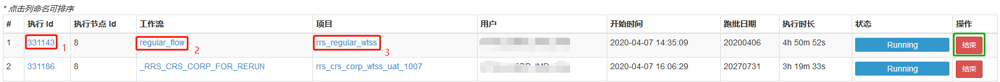
 
当前运行工作流列表的每一行都列出了当前正在单次运行的工作流运行状态以及相应的基本信息，具体请参考上图。
 
当前运行工作流列表支持按列排序和手动结束正在运行的工作流。
1. 通过点击执行 Id 可链接到工作流视图，工作流的任务列表，工作流日志以及运行参数。（详情请参考 5.7）
2. 通过点击工作流名称可链接到工作流视图，工作流执行历史以及执行摘要。（详情请参考 5.7）
3. 通过点击项目名称可链接到工作流归属的项目视图。(详情请参考 5.3)
4. 支持根据工作流名称，项目名称和用户名等进行快速查找和高级过滤。

### 4.5.2 最近完成工作流列表

 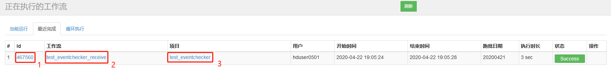
 
最近完成工作流列表的每一行都列出了最近完成的单次运行和循环执行的工作流的基本信息，具体请参考上图。

### 4.5.3 循环执行工作流列表

 

循环执行工作流列表支持手动结束正在循环运行的工作流操作。

### 4.5.4 历史重跑工作流列表

 
显示当前正在运行的历史重跑任务，可以在此页面终止正在执行的历史重跑任务。

## 4.6 执行历史页

 

执行历史页中列出了所有工作流的执行历史记录。支持对列表进行按列排序、快速查找（根据执行 Id ，工作流名称或者项目名称）、通过输入更详细的信息进行高级过滤等操作。

### 4.6.1 工作流执行历史记录列表

 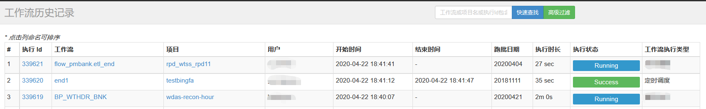

工作流执行历史记录列表每一行都列出了工作流的运行状态，执行类型以及相应的基本信息。
 
### 4.6.2 执行历史高级过滤
 
 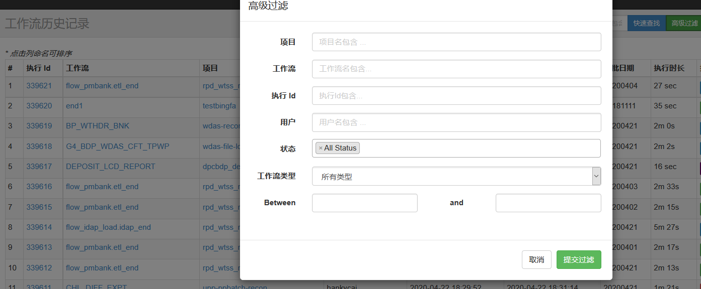
 
模糊查询：根据输入查询内容模糊匹配工作流历史记录

精确查询：根据输入查询内容精确匹配工作流历史记录

### 4.6.3支持批量任务重跑

用户可以批量拉起需要重跑的任务。


## 4.7 用户参数页

 

用户参数页包含用户参数列表，支持新增用户参数、修改已有用户参数操作。

 

 
 
此功能模块实现了一个用户级别的静态全局变量，避免了用户每次修改参数时都得手动更改项目文件脚本，再次上传项目文件和发版。此变量只有变量拥有者可以编辑，变量拥有者可以分享变量给其他用户使用(只读)。

**变量作用域：**
变量创建者拥有读写权限，授权用户具有可读权限

**变量优先级：**
工作流动态全局变量 > 系统临时全局参数 > properties 参数配置文件 > 系统默认值 > 用户级别静态全局变量    （properties 参数配置文件请参考 5.2.3， 系统临时全局参数请参考 5.4.6，工作流动态全局变量请参考 5.4.6.1）

**变量作用时效：**
工作流启动时候生效，如果修改了变量值，下次执行生效

**注意事项：**
- 用户在 Job 脚本文件内引入全局变量，格式为 ${KEY}， Schedulis 在执行此脚本的时候会将全局变量替换为其对应的值，注意一定要有对应的读权限，否则 Schedulis 将不能解析此变量，会把 ${KEY} 当成字符串解析。
- 不能在 .job 文件的 type，user.to.proxy，dependencies 属性中引用全局变量，如 type=${abc}。
- 不能在 .sh，.py， .hql， .sql 等脚本文件中引用全局变量

## 4.8 系统管理页

 

系统管理页需要管理员权限才可以使用。系统管理页包含用户管理，部门管理、部门管理、资源分组管理，人员变动异常清单，运维人员管理，这五个子页面，
提供快速查找（根据用户名包含，部门名包含）、新增用户、修改已有用户、新增部门、修改已有部门、新增资源分组、修改已有资源分组等功能。

### 4.8.1 用户管理

 
 
用户管理子页支持根据用户名包含进行快速查找、新增用户和修改已有用户功能。
用户信息中，包含了用户角色：普通用户和管理员、用户种类：系统用户和实名用户。

### 4.8.2 部门管理

 
 
部门管理子页支持根据部门名称包含进行快速查找、新增部门和修改已有部门功能。
**注意：** 须将部门分配到相应的资源分组中。

### 4.8.3 资源分组管理

 

资源分组管理子页支持新增分组和修改已有分组功能。

#### 4.8.3.1 多租户方案

**背景：**
资源分组管理其实就是系统的多租户管理方案，此方案旨在将集群中的执行节点根据资源分组列表，实现租户之间资源不互通的物理隔离，用户可以根据该租户的批量情况，自由地将租户分配到某个合适的资源分组中。以此来避免这样一个场景：某一用户的批量将集群资源占满，导致其他用户无法提交任务。

**使用说明：**
- 在系统管理功能模块的资源分组管理子页中，点击新增资源分组，即可按照用户意愿新增一个物理隔离的资源组，用户可以自由决定将指定的执行节点划分到这个资源分组中。
- 在部门管理子页中，用户可以根据该部门的业务批量数量以及所占资源大小，将该部门分配到一个已创建的资源分组中。
- 在该部门底下的所有用户所提交的全部工作流，会只在这个资源分组中被执行。
- 对于一个资源分组中的用户所提交的工作流，Schedulis 系统使用负载均衡算法，将该工作流分配到所属资源分组中最优的执行节点去执行。

#### 4.8.3.2 租户级别的调度开关

系统支持按照租户进行+调度开关，管理员用户可点击“修改”对分组调度状态进行设置。只有任务提交用户所在的租户的调度状态为“true”时，该任务才可以正常调度。

调度配置开关优先级：

系统级别 > 租户级别 > 工作流级别

### 4.8.4 变更人员异常清单

 

展示已经离职的人员或者部门变更的人员列表

### 4.8.5 运维人员管理

 

提供部门的运维人员增删改查的功能。

### 4.8.6 例外人员


支持增加、删除告警例外人员，该列表中的用户将无法被设置为接收告警人员。

## 4.9 批次管理页

### 4.9.1 一键HOLD批


- 目前仅对系统管理员开放
- 查询列表展示所有受HOLD批影响的工作流
- 操作-恢复：该工作流恢复为原来状态，继续执行
- 操作-终止：该工作流不再执行，改为终态

#### 4.9.1.1 操作-一键HOLD批


- HOLD批类型：目前仅支持暂停模式
- HOLD批级别：可选全局HOLD批、租户级别、用户级别、自定义（自选工作流）
- 范围设置（非全局HOLD批级别可设置，可多选）：根据所选择的HOLD批级别，选择不同的HOLD批影响范围
- 关键路径白名单（非自定义级别可设置，可多选）：根据所选择的关键路径，发起HOLD批操作后，该关键路径下的工作流将不受影响，继续正常执行。可与工作流白名单叠加使用
- 工作流白名单（非自定义级别可设置，可多选）：项目-工作流 格式；根据所选择的工作流，发起HOLD批操作后，这些工作流将不受影响，继续正常执行。可与关键路径白名单叠加使用
- 操作-一键HOLD批：发起HOLD批操作，受影响的工作流将进入系统暂停状态（SYSTEM_PAUSED），期间工作流暂停执行，且不能作其他操作，HOLD批期间不能手动发起新的工作流

使用示例：

1. HOLD批级别选择用户级别，范围设置此时可选择用户，选择test001、test002用户
2. 关键路径选择’管理层报表‘、’周转金批扣‘；工作流白名单选择’IMS_shangbao_0118a-nine_01‘、’AB-test_eventchecker_receive_1‘
3. 点击’一键HOLD批‘，待请求完成后，test001、test002用户提交的工作流将进入系统暂停状态，但如果该工作流属于关键路径白名单或工作流白名单，则不受该批次影响，继续执行

#### 4.9.1.2 操作-一键恢复


- HOLD批级别：可选全局HOLD批、租户级别、用户级别、自定义（自选工作流）
- 批次号：根据所选级别不同加载不同的批次号，按批次恢复工作流
- 范围设置（非全局HOLD批级别可设置，可多选）：选择需要恢复的范围
- 工作流黑名单（非自定义级别可设置，可多选）：所选择的工作流将终止执行

使用示例：

1. 上例中一键HOLD批发起后，test001、test002用户提交的工作流将以批次’8905ae2a-b0e9-482f-8b0d-7bc51da9e4f3‘进行HOLD批
2. 一键恢复中选择用户级别，批次号选择’8905ae2a-b0e9-482f-8b0d-7bc51da9e4f3‘，范围设置选择test001用户，工作流黑名单选择’all_file_type_run_today_h-sample‘
3. 点击’一键恢复‘，待请求完成后，test001用户提交的工作流将恢复执行，test002用户提交的工作流和黑名单选择的工作流将被终止

#### 4.9.1.3 备注

- 工作流在hold批时，对于新提交的同项目同名工作流，如果没有设置并发执行，则触发告警；如果设置并发执行，则提交到hold批中，可恢复执行

# 5 使用说明

**注意：请在 Chrome 浏览器中操作使用 Schedulis 系统。**

## 5.0 系统登录

 
 使用chrome访问schedulis系统登录页面，登录schedulis系统，如果没有用户可以向平台管理人员申请。  
 1.35.0版本同步LDAP验密错误提示

## 5.1 创建项目

点击导航栏项目选项，即可跳转到项目功能模块。（详情请参考 4.3）
创建项目是第一步，只有先在界面上创建了项目，才可以上传开发好的工作流 ZIP 包。创建项目时必须填写项目名称和项目描述。

 

 

项目创建完毕之后会直接跳转到项目的详情页面。项目详情页面包含工作流列表、权限列表、项目操作记录列表；支持上传项目文件、下载项目文件、删除项目等操作；对于整个项目，支持定时调度所有工作流、立即执行所有工作流和折叠/展开工作流列表等操作。

### 5.1.1 项目基本信息


依次点击小红框可以修改项目描述、项目创建人、项目下总运行任务数量
项目下总运行任务数量：当数量大于0时，该项目下所有工作流同时执行的任务数不会超过所设置数量，datachecker和eventchecker类型任务不受此控制

## 5.2 开发项目

一个项目底下可以有多个工作流，一个工作流底下可以有多个子工作流和多个任务，一个任务包含一个 .job 文件，即任务描述文件，以及一个可选的 .properties 文件，即参数配置文件。最终将所有的文件和文件夹放在同一个文件夹底下，打包成一个 ZIP 包，进行上传，便成功开发了一个项目。
项目的总体开发过程分为以下几个步骤：
- 新建项目文件夹
- 创建任务文件
- 创建参数配置文件（可选）
- 打包成一个 ZIP 包
- 将 ZIP 包上传到 Schedulis 系统

### 5.2.1 新建项目文件夹

用户在本地电脑的硬盘中新建一个文件夹，文件夹可以自由命名。进入文件夹，在文件夹中开发任务文件，或者根据用户逻辑再创建子文件夹，在子文件夹底下开发任务文件。

### 5.2.2 创建任务文件

任务文件为普通的文本文件，以 .job 为文件的后缀。可以使用任意文本编辑器进行编辑，例如：Sublime Text、Notepad++ 等常见的文本编辑器。支持中文，推荐使用 UFT-8 编码格式进行编辑。任务文件的内容为一行行的 KEY=VALUE 配置，以一个普通的 EventChecker 任务为例，.job 任务描述文件的内容如下图所示：

 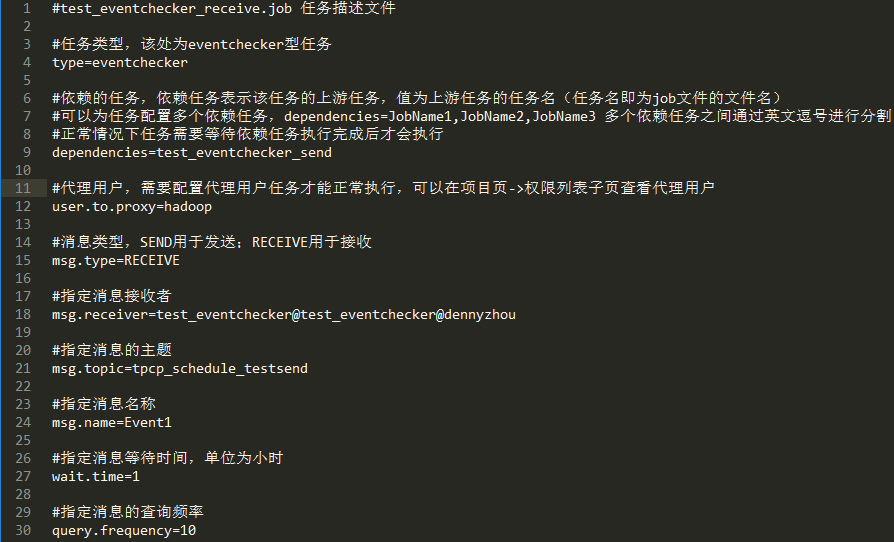

用户可在 .job 任务文件中给任务配置标签，目前支持配置 label.1, label.2, label.3。当配置 label.n=true 时，即表示为该 job 配置了 n 标签，在工作流视图中可批量对该类 job 进行批量关闭和打开。（详见 5.4.1）

### 5.2.3 创建参数配置文件

在一个工作流中，.job 文件或者 Job 的脚本文件，例如：SQL、Python 等文件中往往需要使用一些参数。Schedulis 支持以文件形式进行参数配置，参数配置文件为普通的文本文件，以 .properties 为后缀，在配置文件中以 KEY=VALUE 的形式配置参数。

关于配置文件的可读问题：
- 任务描述文件可以读取同一级别目录以及父目录的参数配置文件。
- 任务描述文件不可以读取其子目录下的参数配置文件。

 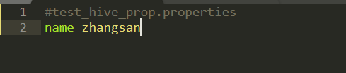

用户可以在 .job 文件中引用配置的参数，也可以在 SQL、Python 等脚本中使用同样的方式引用配置参数。例子中的 ${name} 会在任务执行前被替换成 zhangsan 。

 

不同的配置文件或者同一份配置文件会存在配置相同的 KEY 的情况，这些配置是存在优先级区分的。同名的 KEY 的优先级规则：
- 同一配置文件中，存在相同的 KEY 配置，后配置的覆盖先配置的。

 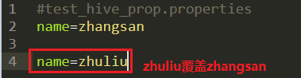

- 同一目录不同配置文件，存在相同的 KEY 配置，后加载的配置文件覆盖先加载的配置文件（配置文件按照字典序由小到大加载）
- 不同目录不同配置文件，存在相同的 KEY 配置，子目录的配置文件会覆盖父目录的配置文件

 

- 在调度或者执行工作流的界面上也可以配置参数，在该界面上配置的参数具有更高优先级，会覆盖掉 .properties 文件中的同名配置参数。

- 参数配置优先级：工作流动态全局变量 > 系统临时全局参数 > properties 参数配置文件 > 系统默认值 > 用户级别静态全局变量   （系统临时全局参数请参考 5.4.6，工作流动态全局变量请参考 5.4.6.1）

除了用户自定义的参数，目前 Schedulis 抽象出了一套内置的时间参数供业务使用，具体参数列表参看附录中的 Schedulis 内置参数列表。

### 5.2.4 打包项目文件夹

项目文件编辑完成之后，需要把项目中涉及的所有文件打包到一个 ZIP 压缩包之中。
备注：
    1、文件的相互引用需保证相对路径的正确性；
    2、.job、.flow、.properties、.zip文件名长度小于128个字符，文件名由[a-zA-Z_-0-9]组成；

### 5.2.5 上传项目

在已经创建好的项目页中，点击上传项目按钮，选择开发好的项目 ZIP 包，完成上传项目。

 
 
1.32.0改动：

- 添加job数量限制，默认最多支持200个job，若超过数量，会提示错误但项目仍可上传成功
- flow和job名称不能超过128个字符，否则提示错误但项目仍可上传成功

## 5.3 项目视图

项目上传完成之后，会跳转到项目详情页面，分为工作流列表、权限列表、项目操作记录三个子页。

### 5.3.1 工作流规则

一个工作流是子工作流和任务的集合。这些任务和子工作流可以相互关联组成 DAG (Directed Acyclic Graph)，其中 DAG 末端节点的名称即为该工作流的名称。任务之间的依赖关系通过 Job 描述文件中的 dependencies 属性来定义，如 5.2.2 中 test\_eventchecker\_receive 任务依赖的任务是 test\_eventchecker\_send 任务，这两个任务组成一个工作流。test\_eventchecker\_send 任务的配置如下图所示：

 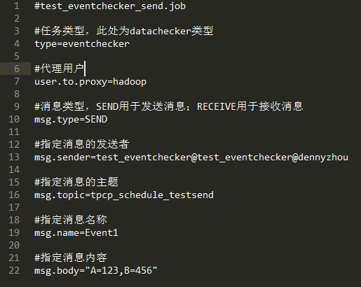

在 test\_eventchecker\_send 任务中没有再依赖其它的任务。由此可知这个工作流只由两个任务组成，其中 test\_eventchecker\_send 为上游任务，test\_eventchecker\_receive 为下游任务。所以工作流的名字以末端任务名字命名，为：test\_eventchecker\_receive。工作流的血缘图如下所示：

 

### 5.3.2 工作流列表


 
 可展开工作流下的所有任务列表
 

 
 对于每个工作流，可以对之执行定时调度、信号调度、立即执行、查看执行历史、应用信息登记操作。对于工作流下面的任务列表，可以对每一个任务执行定时调度、立即执行、依赖运行、查看执行历史、应用信息登记操作。

### 5.3.3 任务视图

在工作流列表下展开任务列表，可点击任务名查看任务的详细信息，包括任务参数、任务执行历史、执行条件等。其中任务参数是根据用户创建的任务文件（.job 文件）进行键值对解析获得的。用户可在任务文件中配置注释字段，以便在页面上查看任务的详细描述情况。


在“执行历史” Tag 可以看到该任务的执行历史图表。


### 5.3.4 权限列表

对于项目，Schedulis 包含3个角色和5种权限。3个角色分别为：项目管理员、项目用户和代理用户。5个权限分别为：管理权限、读权限、写权限、执行权限和调度权限。

 

- 如果是项目管理员, 则拥有操作该项目的所有权限(管理，读，写，执行，调度)。
- 项目管理员可以为项目添加项目用户，并为之分配权限，同时可以修改已有项目用户的权限，删除已有项目用户。
- 项目管理员还可以添加新的项目管理员和移除已有的项目管理员。

**权限列表的中的代理用户非常重要，在执行任务的时候需要用到代理用户，即后台实际执行任务的用户** 。 **（注意：代理用户配置之后需要重新登录之后才能生效）**

### 5.3.5 项目操作记录

 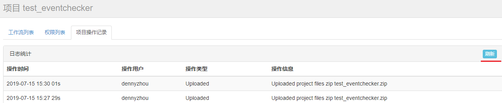
 该页面列出了该项目的所有操作记录，并支持实时刷新项目操作。

### 5.3.6 项目版本


项目版本 tag 可展示最近 10 个工作流的 zip 版本供用户下载。

## 5.4 执行工作流

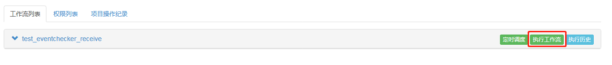

在执行工作流的视窗中可以查看工作流结构图，对工作流进行通用告警设置、执行超时设置、执行失败设置、并发执行设置、工作流参数设置和循环执行等操作，然后点击执行按钮，触发工作流立即执行；也可选择使用系统默认参数，直接点击执行按钮，使工作流一键执行。

### 5.4.1 工作流结构图

 
 
用户可以选择手动对工作流进行设置，或者使用系统默认设置。

对于工作流结构图中的每个节点，用户可以通过右键点击选定的节点，手动地对其进行一系列操作：

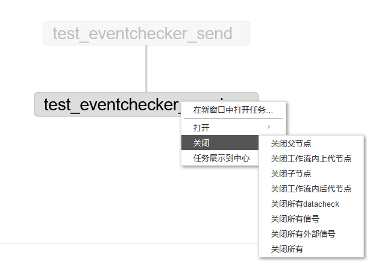

如果用户对任务配置了标签，则可以通过右键进行批量关闭或打开。


用户可以在工作流执行过程中打开关闭状态的任务。


### 5.4.2 通用告警设置


告警列表仅支持配置实名用户，通用告警设置可以分为两种：

    1.工作流执行失败告警设置和工作流执行成功告警设置。
    
    2.工作流重跑告警。

#### 5.4.2.1 工作流执行失败告警

工作流执行失败告警可以设置的告警策略，目前有两种：一种是在工作流中某一个任务失败的时候立即触发告警；另一种是在所有正在执行的工作流完成之后再触发告警。可以自由选择告警策略，设置告警级别，填写告警通知的用户列表。系统会根据告警的级别以邮件、通讯消息、电话等多种方式通知用户。

 

工作流执行类型：

- 调度执行（正常工作流调度执行）

- 功能验证（用户单次执行工作流时，即用户点击“执行工作流”进行执行时，需要用户选择本次执行是功能验证/异常重跑，不给默认值，必选）

- 异常重跑（上次执行类型为调度执行，且用户点击“准备执行”进行工作流执行时，默认是“异常重跑”）
  
  告警示例：
  
  
 
#### 5.4.2.2 工作流执行成功告警
 
工作流执行成功时可以自由选择是否告警，设置告警级别，填写告警通知的用户列表。具体告警级别相对应的告警方式，请参考附录 7.2 告警级别与对应通知方式参照表

 

 告警示例：

 

#### 5.4.2.3 工作流重跑告警

 设置了此告警，则此工作流所有的下游工作流都会收到告警。注意：只对单次执行生效 ，对定时调度、历史重跑，循环执行这三种调度策略不生效。
 

 告警示例：

 

### 5.4.3 执行超时设置

 
 
单次执行工作流支持设置超时告警，用户可以自由选择当工作流没有在指定的执行时间内完成，是否选择触发超时告警。
告警规则分为：SUCCESS 和 FINISH，即工作流是否在指定时间内成功或者结束。用户指定超时时间，告警级别，根据需求选择发送超时告警邮件（填上告警邮件地址）或者终止工作流。
超时时间的格式是 HH:MM，单位是小时和分钟，例如18分钟任务还未完成触发超时告警，时间格式为 00:18。

### 5.4.4 执行失败设置

可以在该页面设置一些工作流执行失败时的策略：完成当前正在运行的任务、结束正在执行的任务和完成所有可以执行的任务。
另外，用户还可以对一些指定的任务（可以是全部任务列表）或者子工作流，进行失败重跑设置和失败跳过设置。
当系统已经完成了用户设置的失败重跑以及失败跳过操作后，工作流仍然处于执行失败状态的，系统就会根据用户选择的三个失败策略中的一个，进行相应的后续操作。

- 如果同时设置工作流错误暂停和任务失败跳过，则先跳过失败任务，如果后续有任务失败则工作流暂停。
- 如果工作流设置了失败暂停，并且任务设置了失败重试，如果某个任务失败，失败任务先进行重试，如果重试仍然失败，则工作流暂停。
- 重跑会继承上一次的 properties 参数文件，sh 文件和 job 脚本文件则使用项目最新版本的文件。


- 任务跳过策略包括直接跳过，先重跑后跳过。用户可以在页面上的选项框进行设置，如果对 job 进行勾选则直接跳过，否则先重跑再跳过。
  
  

#### 5.4.4.1 失败暂停重跑

失败策略选择 **失败分支暂停执行** 时，当任务执行失败，任务状态会显示为FAILED_WAITING，工作流状态为FAILED_FINISHING，如下图所示


1、这时可以在已完成（状态为'RETRIED_SUCCEEDED', 'SUCCEEDED', 'SKIPPED', 'FAILED_SKIPPED', 'FAILED_SKIPPED_DISABLED'）的任务右键选择**打开**，任务会重置为READY状态


2、  
右上角**重试失败** 将会重跑第1步中打开的任务和所有FAILED_WAITING状态的任务
右键FAILED_WAITING任务选择**重跑任务** 将会重跑第1步中打开的任务和当前FAILED_WAITING状态的任务
**重试当前job** 仅重跑当前FAILED_WAITING任务，不会重跑第1步中打开的任务


#### 5.4.4.2 单个任务重跑

支持对运行中的任务右键选择**任务重跑**，该任务将会强制结束并重新执行


#### 5.4.4.3 yarn、jobserver任务

对于yarn和jobserver任务，如果在任务自动重试、手动重跑、准备执行操作时，需要kill服务端的任务，可以选择 **强制杀死失败任务的子任务（jobserver,yarn,linkis）** ，默认为 **直接重跑**


### 5.4.5 并发执行配置

可以在该页面配置策略来处理重新提交的同名工作流，在上一次提交的工作流未运行完成时，对于新一次提交的同名工作流，并发执行策略包含跳过执行、同时运行和设置管道，管道还可以分为 Level 1 和 Level 2 等级。

 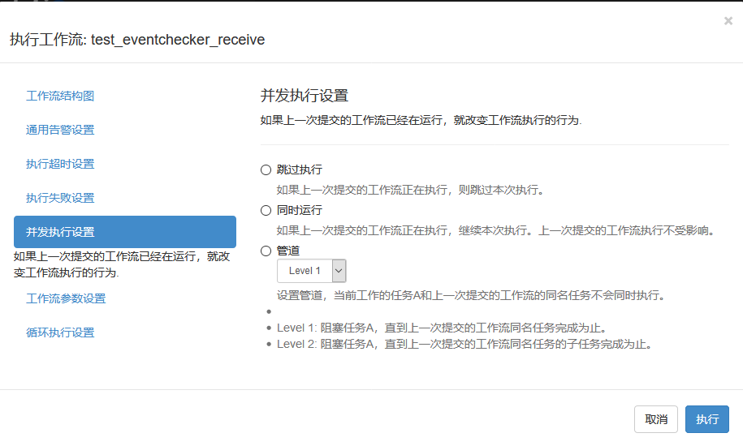

除了按照系统默认的工作流并发度来运行工作流之外，用户还可以按照自己的设计来控制工作流中的 Job 并发数目。可以在工作流参数设置里面（详情请参考 5.4.6），添加参数 flow.num.job.threads 。例如设置10个并发作业度：

 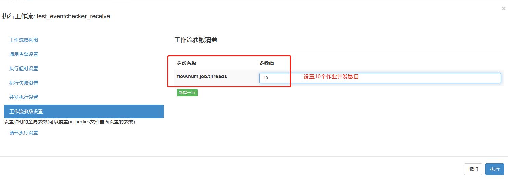

### 5.4.6 工作流参数配置

在该页面可以设置工作流的临时全局参数，该参数会覆盖项目包中 properties 参数配置文件中的 KEY 值相同的参数。

 
 
参数配置优先级：工作流动态全局变量 > 系统临时全局参数 > properties 参数配置文件 > 系统默认值 > 用户级别静态全局变量 （工作流动态全局变量请参考 5.4.6.1）

#### 5.4.6.1 工作流动态全局变量参数设置

Schedulis 支持基于工作流级别的动态全局变量，可以让工作流运行参数可以直接被工作流中的任意一个 Job 引用。
用户在 Shell 脚本内将一个关于动态参数的 JSON 串写入 JOB\_OUTPUT\_PROP\_FILE，后续的 Job 就可以在 .job 文件内直接使用 ${KEY} 来读取 JSON 中相对应参数的值。（ KEY 需与 JSON 中的变量名相匹配）

以下是一个使用工作流动态全局变量的例子：

1. 书写一个 Command 类型的 Job(test.job)，此 Job 执行一个 test.sh 脚本

 

2. 将一个关于动态变量的 JSON 写入 JOB\_OUTPUT\_PROP\_FILE ，注意动态变量的 KEY 必须以 all\_ 开头

 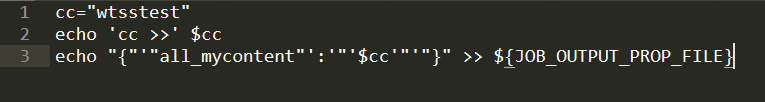

3. 书写一个依赖 Job，读取之前的动态变量值

 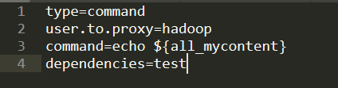
 
参数配置优先级：工作流动态全局变量 > 系统临时全局参数 > properties 参数配置文件 > 系统默认值 > 用户级别静态全局变量    
 
#### 5.4.6.2 工作流动态全局变量支持局部范围生效

Schedulis 提供一个参数 ns_wtss (该参数可通过任何途径设置，比如执行临时参数，properties 参数配置文件，用户参数等) ，此参数默认为 true，表示参数为全局参数；如果设置此参数为 false，表示此参数不再是全局变量，而是只对依赖的下一级 Job 生效。

例如：

1. 在 .properties 文件中设置参数 ns_wtss 为 false


2. 将关于动态参数的 JSON 写入 JOB\_OUTPUT\_PROP\_FILE


此时的 all_mycontent 动态变量并非全局范围生效，该变量只能对依赖的下一级 Job 生效。

### 5.4.7 循环执行设置

循环执行设置可以在一次工作流结束后，立即开始下一次的执行，并且需要带上上一次执行的相关参数。    
该功能主要适用于这样的场景：业务团队在开发工作流时有需要在一次执行结束之后立即进行下一次任务，而每一次任务的执行时长是不确定的，没办法设置固定时间拉起下一次任务。    
用户可以对循环执行错误时选择失败策略：终止循环执行流程或者继续执行循环执行流程。    
此外，用户可以在页面上手动终止循环执行的工作流。当循环执行中断时，可以选择告警级别以及告警人列表。

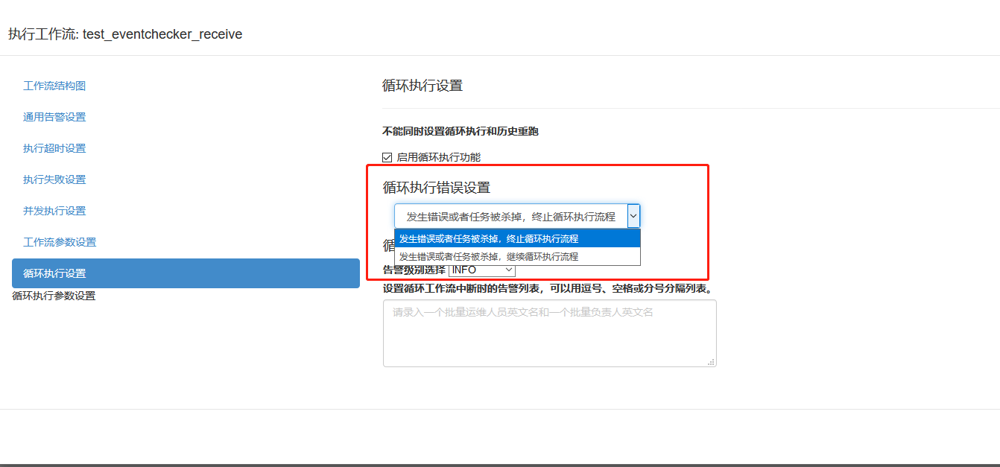

当该工作流已存在循环执行时，重新提交新的循环执行会kill掉原来的循环执行，并且使用新的配置启动新一轮循环执行，该操作提示如下图


### 5.4.8 历史重跑设置

历史重跑设置，用于提交历史重跑任务，可以选择跑批日期，跑批时间段，历史重跑任务告警等功能，历史重跑提交运行后可以在历史重跑列表页面4.5.4，查看任务执行情况。


历史重跑执行区间：当前时间在所设置区间内时，历史重跑任务才会执行，默认为当天0时-次日0时（可修改），如需全天执行，可以将开始时间和结束时间设为相同  
历史重跑锁定当前版本：如果在多批次历史重跑过程中重新上传了项目，勾选时将使用提交历史重跑时的项目版本，不勾选则使用项目最新版本  
历史重跑日期计算：（历史重跑时间区间∪历史重跑自然日选择)-历史重跑跳过日期选择  
历史重跑并发执行顺序设置：历史重跑支持时间顺序执行和均匀切分执行两种方式并发执行。以并发数3为例，回跑2023-01-01至2023-03-31三个月的数据，均匀切分执行为2023-01-01、2023-02-01、2023-03-01，时间顺序执行为2023-01-01、2023-01-02、2023-01-03并发执行。
历史重跑并发数设置：配置历史重跑的并发数量


历史重跑运行列表可查看Running、Preparing和Paused状态的数据，可以点击kill取消历史重跑

## 5.5 定时调度工作流

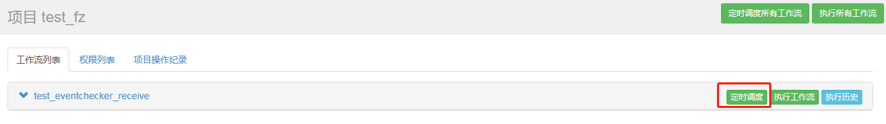

在定时调度工作流的视窗中可以查看工作流结构图、对工作流进行通用告警设置、执行失败设置、并发执行设置、任务跳过时间设置、工作流参数设置和定时调度等操作，点击执行调度按钮，触发调度任务的提交；也可选择使用系统默认参数，直接点击执行按钮，使工作流一键调度。

### 5.5.1 工作流结构图


### 5.5.2 通用告警设置

通用告警设置可以分为两种：工作流执行失败告警设置和工作流执行成功告警设置。

#### 5.5.2.1 工作流执行失败告警

 
 
（详情请参考 5.4.2.1）
 
#### 5.5.2.2 工作流执行成功告警
 
 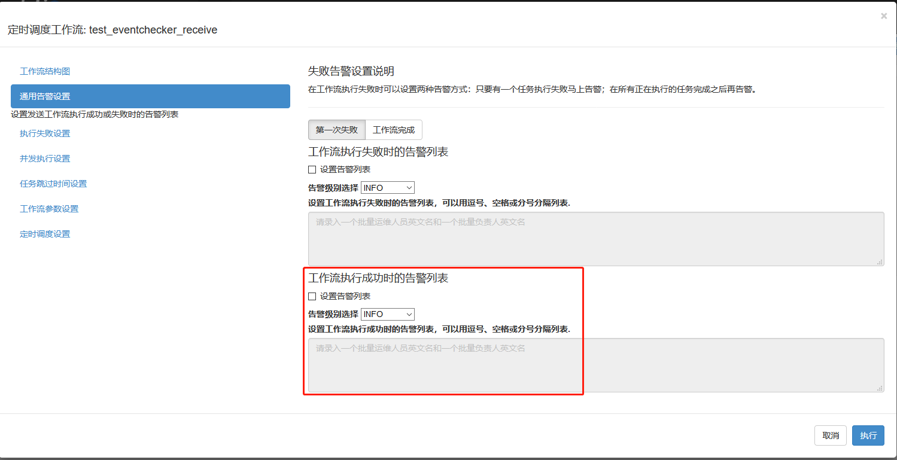
 
（详情请参考 5.4.2.2）

### 5.5.3 执行失败设置


（详情请参考 5.4.4）

### 5.5.4 并发执行设置

 

（详情请参考 5.4.5）

### 5.5.5 任务跳过时间设置

在定时调度的工作流中，为一些 Job 提供 Cron 表达式，如果定时调度工作流的提交时间和指定 Job 的 Cron 时间一致（只精确到年月日），该 Job 就会被跳过执行。

- 适用场景：

适用于某些场景下，用户需要定时调度作业流中的某些 Job 或者某些子工作流在指定日期不执行。

- 使用说明：

选择要跳过执行的 Job，输入正确的 Cron 表达式（只精确到年月日），当 Cron 表达式输入正确后，页面会展示 TOP 10 时间，否则表示 Cron 表达式输入有误。

 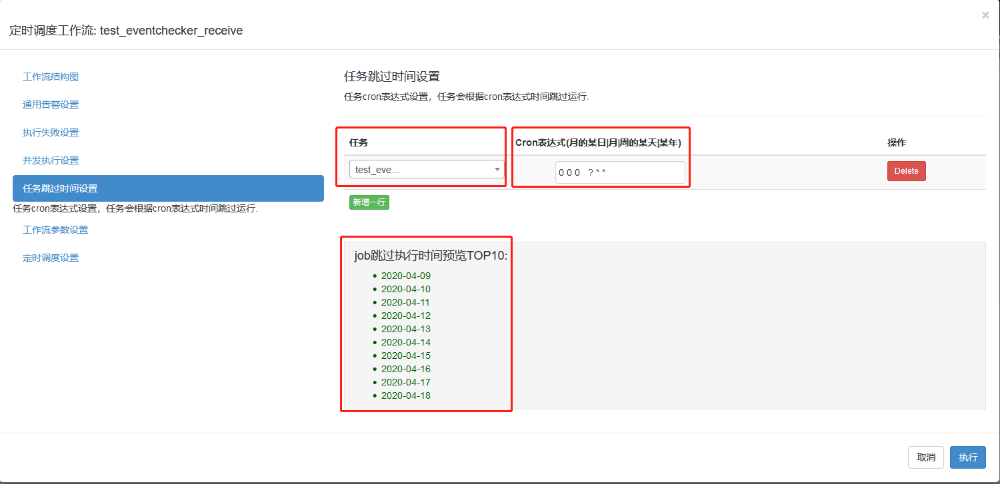

### 5.5.6 工作流参数设置

 

（详情请参考 5.4.6）

### 5.5.7 定时调度设置

定时调度以 Asia/Shanghai 为参考时区，以 Quartz 的 Cron 表达式来设置定时任务的调度时间。提供Crontab模板给用户选择，当 Cron 表达式输入正确后，页面会展示 TOP 10 时间，否则表示 Cron 表达式输入有误。用户可配置定时调度开始时间，即时间达到开始时间的时候才开始进行调度，晚于结束时间则将调度状态置为关闭。用户也可以在设置定时调度时添加备注信息。


是否跨天执行 配置说明：  
例如今天是20221123

- 如果该工作流被标记为跨天，则在工作流运行周期内，上报IMS的时候该工作流和工作流内的任务上报run_date 为 20221123
- 如果该工作流被标记为非跨天（默认），则在工作流运行周期内，上报IMS的时候该工作流和工作流内的任务上报run_date 为 20221122

Cron 表达式的使用说明可以参考如下链接：

[http://www.quartz-scheduler.org/documentation/quartz-2.3.0/tutorials/tutorial-lesson-06.html](http://www.quartz-scheduler.org/documentation/quartz-2.3.0/tutorials/tutorial-lesson-06.html)

### 5.5.8 定时调度-应用信息关联

满足以下规则时，新增或修改定时调度后，执行时间将填充到应用信息的计划开始时间：
1、定时调度每日执行一次
2、不能配置开始、结束时间
3、仅填充工作流级别应用信息
4、该工作流未配置应用信息

## 5.6 信号调度工作流

在信号调度工作流的视窗中可以查看工作流结构图、对工作流进行通用告警设置、执行失败设置、并发执行设置、任务跳过时间设置、工作流参数设置和信号调度等操作，点击执行调度按钮，触发调度任务的提交。


### 5.6.1 工作流结构图

（详情请参考 5.5.1）

### 5.6.2 通用告警设置

（详情请参考 5.5.2）

### 5.6.3 执行失败设置

（详情请参考 5.5.3）

### 5.6.4 工作流参数设置

（详情请参考 5.5.4）

### 5.6.5 信号调度配置


可在该页面配置信号的主题（Topic）、信号名称（Name）、信号别名（Message Key）、token信息（Work Flow Token）以及调度备注信息（Comment）。配置好信号调度后，当系统接收到相匹配的信号，工作流将会执行。（详情可参考 7 信号调度）

## 5.7 子工作流/任务的运行与调度

对于工作流底下的子工作流和任务列表，Schedulis 系统支持对用户选定的子工作流/任务，进行定时调度、运行任务（立即执行）、依赖运行和查看执行历史功能。
定时调度，立即执行以及查看执行历史的操作，其逻辑与对工作流的操作类似，在此就不再描述。
至于子工作流/任务的依赖运行，即是对与用户选定的节点有上下级依赖关系的一系列子工作流/任务集合，进行立即执行操作。

 

### 5.7.1 子工作流的告警设置

对于定时调度的工作流，用户可以对该工作流下的子工作流/任务进行告警设置
 
**使用说明：导航栏上的定时调度 >> 设置告警选项**
**支持告警策略：**

- 子工作流/任务超时告警（具体操作详情请参考 5.4.3）

- 子工作流/任务事件规则告警：

 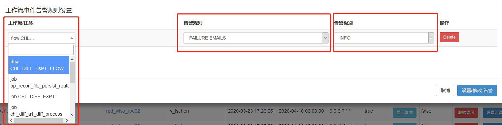
 
用户自由选择需要告警的子工作流/任务、告警规则：SUCCESS / FAILURE / FINISH、告警级别：INFO / MINOR / WARNING / CRITICAL / MAJOR / CLEAR，来设置触发子工作流/任务的告警事件。

### 5.7.2 子工作流的条件执行

**适用场景：**
- 支持根据运行时的动态参数触发任务执行；
- 支持通过父辈任务节点的状态触发子任务节点执行。

**使用说明：**
如果某个任务需要按条件触发执行，需要进行如下设置：
1. 任务的触发条件在 YAML 文件中通过 condition 字段描述，而且属于 Job 级别的属性字段；
2. 设置 condition 字段的任务只有在执行条件满足的时候才会触发执行，否则会被跳过。

当任务是根据父辈节点运行时的动态参数触发执行时：
- 可以通过表达式组合不同上游 Job 产生的运行时参数，目前支持如下运算符：
    - 比较运算符：==， !=， >， >=， <， <=
    - 逻辑运算符：&&， ||， !
- 可以通过 “${}” 进行变量替换；
- 可以使用 “:” 来指定当前 Job 要使用的运行时参数由哪个 Job 产生(设置参数的命名空间)，将运行时参数和产生参数的 Job 绑定；
- 处于子工作流 (EmbeddedFlow) 中的 Job 只能引用属于同一个子工作流中 Job 产生的运行时参数。

示例 1：
JobC 依赖 JobA 产生的参数 param1 和 JobB 产生的参数 param2，JobC condition 字段中的表达式引用这两个参数运算结果为 TRUE 的时候 JobC 才会触发执行。
- conditional_workflow1.flow
```
nodes:
 - name: JobA
   type: command
   config:
     command: bash ./write_to_props1.sh 
 - name: JobB
   type: command
   config:
     command: bash ./write_to_props2.sh 
 - name: JobC
   type: command
   dependsOn:
     - JobA
     - JobB
   config:
     command: echo “This is JobC.”
   condition: ${JobA:param1} == 1 && ${JobB:param2} > 5
```
- write\_to\_props1.sh
```
echo {"param1":"1"} > $JOB_OUTPUT_PROP_FILE
```
- write\_to\_props2.sh
```
echo {"param2":"6"} > $JOB_OUTPUT_PROP_FILE
```

当任务是通过获取父辈任务节点的状态触发执行时：
- 目前设置了如下几个宏变量描述父辈任务节点:
    - all_success，默认的状态，即父辈所有节点都执行成功；
    - all_failed，即父辈所有节点都执行失败；
    - all_done，即父辈所有节点都执行完成(成功、失败或者被跳过)；
    - one_failed，即父辈所有节点都执行完成且至少有一个节点执行失败；
    - one_success，即父辈所有节点都执行完成且至少有一个节点执行成功。
    
- condition 字段可以直接引用上面定义的宏变量。

示例 2：
JobA 运行成功之后触发 JobB 执行，JobA 运行失败之后触发 JobC 执行， JobB 或者 JobC 执行成功触发 JobD 执行。
- conditional_workflow2.flow
```
nodes:
 - name: JobA
   type: command
   config:
     command: pwd
 - name: JobB
   type: command
   dependsOn:
     - JobA
   config:
     command: echo “This is JobB.”
   condition: all_success
 - name: JobC
   type: command
   dependsOn:
     - JobA
   config:
     command: echo “This is JobC.”
   condition: all_failed
 - name: JobD
   type: command
   dependsOn:
     - JobB
     - JobC
   config:
     command: pwd
   condition: one_success
```
**场景描述：**
- 默认情况下，如果没有设置 condition 字段，所有任务的执行条件都是：all\_success。用户上传项目 ZIP 包的时候，系统会检测 YAML 文件中是否有定义 condition 字段，如果有 Job 没有设置 condition 字段，默认该字段会被设置为 all\_success。如果在工作流运行的过程中，用户强制杀死了工作流，这个时候所有正在执行的任务都被杀死，同时会无视所有未执行任务设置的执行条件，没有执行的任务都会被跳过执行。
- 如果一个任务的运行失败，它的子节点 condition 字段设置了除 all\_success 之外的某个宏变量，这时 Flow 不会被设置为失败，其他可以运行的任务将会继续运行到不能再触发其他节点为止。
- 即使某些 Job 运行失败了，Flow 的状态可能也会标记为成功。例如：如果 JobC 的触发条件是 JobA 和 JobB 中一个执行成功就触发，假设 JobA 执行成功，JobB 执行失败，这个时候 JobC 会被触发，此时 Flow 还是会被认为会成功运行完成。
- 如果一个任务的执行条件判断没有通过，这个节点将会被跳过，而且这个节点所有的后代节点都被跳过执行，也就是这个节点所开头的所有下游路径会被取消执行。如果用户这个时候只想跳过这个执行条件判断不通过的节点而不跳过执行下游的后代节点，这个时候可以在该节点的子节点增加宏变量来做处理。
- 在做执行条件判断之前会做执行条件参数的检查，用户执行应用系统已经设置的宏变量。对于动态参数用户只能引用相同 Flow 内其他 Job 产生的动态参数，哪怕这个 Job 跟引用它产生的动态的 Job 不在同一条执行路径。用户必须自己保证执行条件的逻辑正确，例如：父节点不应该引用子节点的动态参数。
- 对于一个 Flow 的起始节点不应该设置执行条件，否则这个 Flow 可能永远不能启动。
- 用户可以同时使用动态运行参数和任务执行状态两种执行条件组合一个大的执行条件表达式，例如：condition: one\_success && ${JobA:param1} == 1，但是同一个 Job 的 condition 字段只能引用一个宏变量，因为宏变量被系统认定是互斥的。如果用户只在 condition 设置了动态参数作为执行条件表达式，这个时候系统默认认为这个 Job 的执行条件引用了宏变量 all\_success。

**注意：**
- 只支持父辈的状态或者传入的参数触发条件执行任务，不支持直接获取更高层祖先节点的执行状态或者动态运行参数；
- 只支持同一个 Flow 内的动态参数获取，EmbeddedFlow 不能获取上层 Flow 的动态参数；
- 如果设置了条件执行参数(按依赖父节点状态触发执行)，一旦有父节点任务执行失败，Flow 不会马上标记为失败，必须所有父节点执行完才能确定。

## 5.8 任务详情

在导航栏的定时调度功能模块中可以查询所有的定时调度工作流；
在导航栏的正在运行功能模块中可以查询：正在运行的工作流、最近完成的单次运行的工作流；
在导航栏的执行历史功能模块中可以查询所有的工作流执行状态。


在这些页面中，用户都可以通过一下操作查看相应的信息：
1. 通过点击执行 Id 可链接到工作流视图，工作流的任务列表，工作流日志以及运行参数。
2. 通过点击工作流名称或者项目视图中的执行历史选项可链接到工作流视图，工作流执行历史以及执行摘要。
3. 通过点击项目名称可链接到工作流归属的项目视图。（详情请参考 5.3）

### 5.8.1 工作流视图

工作流视图可以用来表现整体工作流的执行情况，灰色的表示未执行的任务、绿色的表示执行成功的任务、蓝色表示正在执行的任务、红色表示执行失败的任务。

 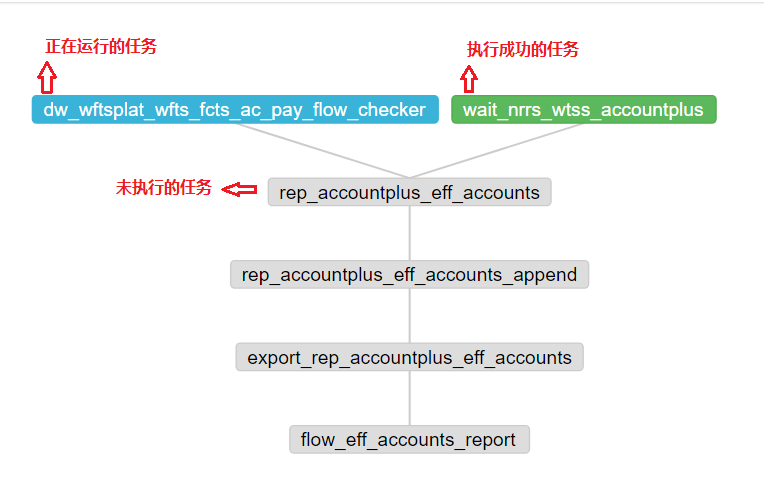

将鼠标移至任务节点处可显示当前任务的状态名称、任务类型、执行时间。


右键节点，可以复制任务名称。


### 5.8.2 任务列表


任务列表页面中列出了已经执行结束的任务（包括成功或者失败）和正在执行的任务列表。可以查看单个任务的执行详细信息，譬如执行时长，也可以查看或下载单个任务的执行日志。

点击 “jobId关系” 可以实时获取任务的 jobId，applicationId 以及 linkisId ，点击 applicationId 可以免密查看相应的 YARN 日志以及 Job History 日志，点击 linkisId 可以直接跳转 Linkis 管理台的任务日志。


也可以通过点击任务名称，查看以图表和表格的形式显示的单个任务运行状况。支持按照任务名、任务状态、任务执行时长（1 h 之内，1 - 2 h，2 - 3 h，3 h 以上）筛选快速查找任务。

 

### 5.8.3 工作流日志

在工作流日志页面可以查工作流的执行日志，对于正在运行的任务也可以实时刷新该工作流的执行日志或者手动结束该工作流。

 
 
### 5.8.4 工作流运行参数

 
 
用户可以通过这个页面，查看工作流的临时系统参数以及工作流运行时输出的动态全局变量。

### 5.8.5 工作流图表

工作流图表和工作流视图类似，都是工作流的 DAG 图，和工作流视图不同的是，工作流图表只描述了任务之间的依赖关系，没有任务的执行状态。

 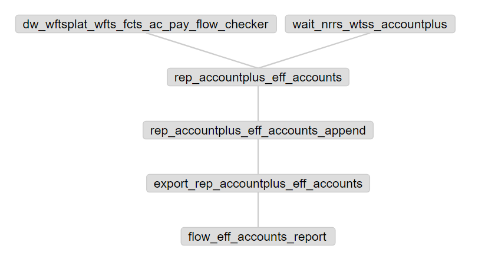
 
### 5.8.6 执行历史
 
执行历史页面，以图表和表格的形式，显示出了工作流的运行状况，支持快速查询和高级过滤。 

### 5.8.7 任务摘要

工作流摘要页面列出了工作流的摘要信息。

 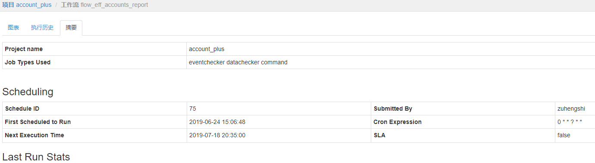
 
### 5.8.8 关联数据

可以在工作流和任务详情页面，查看对应的输入和输出数据


### 5.8.9 历史重跑记录

可以在工作流详情，查看历史重跑设置记录


# 6 批量应用信息管理

## 6.1 背景

Schedulis 目前支持项目级别、工作流级别、job 级别应用信息录入，以及工作流调度 IMS 上报。在新版本的 Schedulis 中，进行任务调度前必须完成应用信息的录入，配置完成调度后，应用信息将会上报至 IMS 中，如果工作流在配置的开始时间之前没有成功调起执行，或者工作流在配置的结束时间之后还未结束，那么告警人将会收到 IMS 告警。

## 6.2 需要配置的应用信息

字段说明：

- 关键批量分组
- 关键路径
- 业务域 (必填)
- 子系统 (必填)
- 业务恢复级别
- 计划开始时间(必填)：工作流计划开始时间
- 计划结束时间(必填)：工作流计划完成时间
- 最迟开始时间(必填)：工作流最迟开始时间
- 最迟结束时间(必填)：工作流最迟完成时间
- 业务/产品一级分类
- 业务/产品二级分类
- 业务描述
- 开发科室(必填)
- 运维科室(必填)

## 6.3 应用信息管理

### 6.3.1 通过 properties 文件配置应用信息

1. 在需要上报的工作流中加入 properties，名字可以自定义，后缀必须为 properties

2. properties 参数说明
   
   | Parameter      | Description                                                                              |
   | -------------- | ---------------------------------------------------------------------------------------- |
   | reportIMS      | true/false，用于判断是否上报ims ，只有值为true（不区分大小写）时才上报                                             |
   | subSystemId    | 必填，子系统 ID                                                                                |
   | planStartTime  | 必填，工作流计划开始时间，格式 hh:mm                                                                    |
   | planFinishTime | 必填，工作流计划完成时间，格式 hh:mm                                                                    |
   | lastStartTime  | 必填, 工作流最迟开始时间，格式 hh:mm                                                                   |
   | lastFinishTime | 必填, 工作流最迟完成时间，格式 hh:mm                                                                   |
   | dcnNumber      | 选填，批次所在的3位 DCN 编号，多个以逗号隔开,例如：101,102，默认值-1                                               |
   | keyPathId      | 必填，关键路径 ID                                                                               |
   | groupId        | 必填，关键批量分组 ID                                                                             |
   | AppDomain      | 必填，业务域                                                                                   |
   | imsUpdater     | 必填，注册人信息                                                                                 |
   | imsRemark      | 选填，告警备注信息（当设置告警信息时，该字段会出现在告警信息中）                                                         |
   | alerterLevel   | 必填，告警级别，包含 critical、major、minor、warn，当级别为 critical、major、minor 时，ECC 会关注该告警，否则只由本部门的运维关注 |
   | busResLvl      | 必填，业务恢复级别                                                                                |
   
   

3. 将 properties 和 job 文件一起压缩成 zip
   
   
   
   做好 zip 包之后上传到项目即可

4. Schedulis 端工作流上报信息查看页面
   
   

5. 上报 IMS 的工作流信息查看地址
   
   环境 API 地址
   
   - SIT 环境： http://127.0.0.1
   - UAT 环境：http://127.0.0.1
   - 生产环境（OA）：http://imsplus.webank.oa.com
   - 生产环境：http://imsplus.webank.com
   - 云管理：http://127.0.0.1
   
   

### 6.3.2 通过 UI 配置应用信息

在项目页面进行工作流应用信息配置。

> 注意：未配置应用信息录入的工作流，不能进行任务调度


目前支持应用信息的新增与更新。

## 6.4 应用状态上报 IMS

用户配置完成工作流的应用信息后，应用信息将会上报至 IMS，开启 IMS 上报开关，如果工作流在配置的开始时间之前没有成功调起执行，或者工作流在配置的结束时间之后还未结束，那么告警人将会收到 IMS 告警。


# 7 信号调度

## 7.1 功能背景

Schedulis 支持通过定时调度或手动来启动一个工作流，但是它们的场景是有限的，有时作业需要根据信号自动执行，虽然存在 eventchecker 兼容信号任务的模型，但是现有基于 eventchecker 的信号调度还存在一些问题。信号调度是 Schedulis 引入的一个新特性，在信号到达时触发一个离线状态的工作流，允许用户定义流所依赖的信号，一旦所有信号准备就绪，将触发工作流执行。

## 7.2 使用流程

1. 信号授权申请
   
   > 注意：只有通过 Schedulis 授权后的信号才可以触发工作流
   
   申请 ITSM 单
   
   
   
   表单模板
   
   
   
   申请通过后，可以在 WTSS 信号管理中看到已授权信号列表
   
   

2. 页面配置
   
   1. 在 Schedulis 项目页面，可以在工作流级别做信号调度配置
      
      
      
      
      
      配置项：
      
      - 信号主题（Topic）
      - 信号名称（Message Name）
      - 信号别名（Message Key）：保存信号消息体的 key，信号调度工作流可以直接引用，引用的参数优先级最高，覆盖其他参数，格式：数字字母下划线
      - 调度备注（comment）
      - Work Flow Token：自定义token
   
   2. 配置完成后可以在调度管理 - 信号调度 tag 中查看配置项、修改告警及 IMS 上报设置
      
      

3. 信号触发
   
   1. 登录 Schedulis 后，在浏览器控制台取得登录用户 session.id，供后续信号发送使用（如果使用Token校验方式，此步骤可以省略）
 
      
   
   2. 可以使用工具发送信号或者 Schedulis rmbsender job 触发
      
      1. 工具发送信号
         
         可以使用 RMB 信号发送工具发送信号至 WTSS，信号须包括以下报文字段：
         
         格式一（不建议）：
         
         {**'eventid'**:**'事件调度id'**,**'sender'**:**'信号发送者'**,**'topic'**:**'消息主题'**,**'msgBody'**:**'消息内容'**,**'sessionId'**:**'会话ID'，'returnExecId': true**}  
         参考报文：
         `{'eventId':'340','sender':'xxx@test@sender','topic':'xxx_test_topic' ,'msgName':'TestJinReceive','sessionId':'868ab721-0ccc-4bd3-8f66-5cdebb76a319','returnExecId': true,'msgBody':'{"reqSysSeq":"2303010QA03998760191257502409393","outputDatasetIdList":["out01_data"],"inputDatasetIdList":["train_data","test01_data","test02_data"],"params":{"VAR_RANGE":"50","MIN_SAMPLE_NUM":"200","RULE_MAX_NUM":"4","TRAIN_METHOD":"HEURISTIC_SEARCH"}}'}`
         
         格式二（建议）：
         
         {**'eventid'**:**'事件调度id'**,**'sender'**:**'信号发送者'**,**'topic'**:**'消息主题'**,**'msgBody'**:**'消息内容'**,**'token'**:**'Work Flow Token','returnExecId': true**}  
         参考报文：
         `{'eventId':'340','sender':'xxx@test@sender','topic':'xxx_test_topic' ,'msgName':'TestJinReceive','token':'868ab721-0ccc-4bd3-8f66-5cdebb76a319','returnExecId': true,'msgBody':'{"reqSysSeq":"2303010QA03998760191257502409393","outputDatasetIdList":["out01_data"],"inputDatasetIdList":["train_data","test01_data","test02_data"],"params":{"VAR_RANGE":"50","MIN_SAMPLE_NUM":"200","RULE_MAX_NUM":"4","TRAIN_METHOD":"HEURISTIC_SEARCH"}}'}`

         注意：
   
         ​        新增自定义token校验，原有的sessionId校验方式保留；
   

   
         说明：
        
         - eventId：信号调度 id，需要在 WTSS 调度管理 - 信号调度 tag 下获取
         - sender：信号发送者
         - topic：信号主题
         - msgBody：信号体，通过信号别名引用
         - sessionid：可从第1步中获取
         - token: 配置信号调度时的Work Flow Token参数
         - returnExecId（非必选）: 信号返回报文是否返回执行Id,仅当传入并且传入值为true的情况，message的返回报文才为执行id。
        
         ​        
   
      2. Schedulis 发送 rmbsender
   
         配置 rmbsender 类型的任务，信号须包括的字段同使用工具发送信号中信号的字段。
   
         

3. 工作流接收到信号后，将会触发工作流执行
   
   

## 7.3 注意事项

1. 信号需要经过 WTSS 授权之后才可以触发工作流。
2. 发送的信号的主题（Topic）、信号名称（MessageName）、Work Flow Token（sessionid与token二选一）需要与工作流配置的信号属性一致，否则无法触发工作流。
3. returnExecId字段非必填，如果没有填或者填入false，返回的message的content就不包含执行Id信息，仅为“ok”

# 8 Job 任务类型

## 8.1 Command 任务

### 8.1.1 需求背景

用户需要以命令行的方式执行或调度一些任务。

### 8.1.2 使用场景

Command 任务是一种基础任务，Command 任务可以用来描述基础的 Shell 脚本、HQL 文件、Python 文件等任何使用命令行执行的任务。

### 8.1.3 配置方法

**Command Shell 类型的任务介绍：**
Command 作业类型是基本的内置类型之一。它使用 Java ProcessBuilder 运行多个 UNIX 命令。在执行过程中，Azkaban 会产生一个运行该命令的过程。

**Command Shell 任务类型的描述文件如下所示：**

```
# type 标示了任务类型为:command，表明任务可以使用命令行执行
type=command

# dependencies 表示当前 Job 所依赖的 Job 名称
dependencies=jobName

# user.to.proxy 标示代理用户，即后台真正执行任务的用户。如果不设置，默认的执行用户为当前登录用户。
user.to.proxy=systemUser

# command 标示执行语句，如有多条执行语句，第二条语句从 command.1 开始
# ‘script/’ 是和任务描述文件在同一级目录的子文件夹
command=do something
command.1=hive -e "show tables;"
command.2=hive -f "script/hive.sql"
command.3=spark_sql -f "script/spark.sql"
…
command.n=sh script/script.sh
```

---

**示例：**

hello1.job

```
type=command
command=echo "This is hello1 job."
```

hello2.job

```
type=command
command=echo "This is hello2 job."
dependencies=hello1
```

将所有 Job 资源文件打包到一个 ZIP 包中，这样一个 Command 类型的 Job 就做好了。

## 8.2 DataChecker 任务

### 8.2.1 需求背景

用户在执行定时 ETL 任务的时候，希望上游的输入表的数据是准备好的，避免定时任务启动之后出现空跑或者在输入数据不齐全的情况下触发定时任务的执行。

### 8.2.2 使用场景

当需要确定上游数据准备好了之后，再触发定时任务执行时，可以使用 DataChecker 任务对上游数据进行检查，确保数据 OK 之后，再触发下游任务执行。

### 8.2.3 配置方法

**DataChecker 任务概述：**

DataChecker 任务类型用来判断第三方系统接口地址同步的数据，或者其他运行的 Job 生成的数据是否已经准备好。

**DataChecker source.type 类型详解：**

| source.type 类型 | 检查的数据源                            |
| -------------- | --------------------------------- |
| bdp            | 第三方系统接口地址数据，依赖于mask数据脱敏项目，暂时不开放使用 |
| job            | Hive Metastore                    |
   
- 当source.type 类型为 job 时，会直接查询 Hive Metastore；当 source.type 类型为 bdp 时，支持第三方系统接口地址查询数据状态
- DataChecker 的 job 类型只能保证 Hive 表的元数据是否写入完成，不能保证数据的完整性。

**DataChecker 任务的描述文件示例如下：**

| Parameter                      | Description                                                                                                         |
| ------------------------------ | ------------------------------------------------------------------------------------------------------------------- |
| type                           | 规定为 datachecker                                                                                                     |
| user.to.proxy                  | 标示后台真正执行任务的用户，如果不设置默认的执行用户为当前登录用户                                                                                   |
| source.type                    | 依赖的数据来源，job 表示是由其他 Job 产生，bdp 表示第三方系统接口地址的数据                                                                        |
| data.object                    | 依赖数据的名称例如：data.object.1=dbname.tablename{partitionlist}                                                             |
| wait.time                      | 描述任务的等待时间，单位是小时                                                                                                     |
| query.frequency                | 描述查询频率，例如设置的查询频率是 10，等待时间是1个小时，该 Job 会在一个小时之内查询 10 次看依赖的数据是否准备好                                                     |
| time.scape                     | 描述依赖数据生成的时间范围，单位是小时。例如设置的查询范围是 24，那就查询最近一天之内依赖的数据是否已经生成。                                                            |
| earliest.finish.time           | 增加一个最早完成时间点参数，设置该时间点，如果没到这个时间点，即使接收到了信号也不算任务完成；最早完成时间的检查频率与checker的检查对象的频率一致，例如：如果每十秒检查一次数据是否到达，最早完成时间的检查也是每十秒检查一致。 |
| earliest.finish.time.cross.day | 最早完成时间是否跨天，如果没有该配置或该配置为 false，则最早完成时间为当天。                                                                           |

**ps: source.type 中的分区信息一定要写全量信息，比如表中为二级分区，如果只写一级分区是检测不到的。**
**配置多个数据源具体格式如下：**

```
type=datachecker
source.type.1=job
data.object.1=cf_ds_ods_mask.bsp_dscs_field{ds=2016-12-15}
...
source.type.n=job
data.object.n=cf_ds_ods_mask.bsp_dscs_field{ds=2016-12-16}

n -> [1,2,3...100]
earliest.finish.time=16:59
```

---

**示例：**

datecheck.job

```
type=datachecker
user.to.proxy=yourProxyUser
data.object=ad_audit_ods_mask.t_amis_plan
source.type.02=job
data.object.02=cf_risk_dw_work.customer_info_01{ds=${run_date}}
query.frequency=144
wait.time=24
```

将所有 Job 资源文件打包到一个 ZIP 包中，这样一个 DataChecker 类型的 Job 就做好了。

## 8.3 EventChecker任务

### 8.3.1 需求背景

在工作流中存在传递消息的场景，通过传递消息来实现基于事件的调度。假如需要收发外部消息，同样可以使用 EventChecker 任务。

### 8.3.2 使用场景

通过消息实现 Flow 之间的依赖；收发外部系统的消息。

### 8.3.3 配置方法

**EventChecker 任务概述：**

EventChecker 任务类型实现了基于事件的调度，利用 Job 收发消息功能，实现了 Flow 之间的依赖，也可用于收发外部系统的消息，但需使用我们提供的客户端工具。

**EventChecker 任务的描述文件示例如下：**

**发送消息：**

| Parameter     | Description                                                     |
| ------------- | --------------------------------------------------------------- |
| type          | 规定为 eventchecker                                                |
| user.to.proxy | 标示后台真正执行任务的用户，如果不设置默认的执行用户为当前登录用户                               |
| msg.type      | 用来指定 Job 的类型，SEND 用于发送消息，RECEIVE 用于接收消息。                        |
| msg.sender    | 指定消息的发送者，需使用 SysName-ProjectName@WFName@JobName 的格式进行定义。        |
| msg.topic     | 指定消息的主题，需使用如下格式： 一级分类编码+“_”+二级分类编码+“_”+三级分类编码，各分级编码由自己的业务场景自定义。 |
| msg.name      | 指定消息名称，由用户自定义。                                                  |
| msg.body      | 指定消息的内容，没有内容发送可以为空。                                             |

**接收消息：**

| Parameter       | Description                                                                                                                                                                               |
| --------------- | ----------------------------------------------------------------------------------------------------------------------------------------------------------------------------------------- |
| type            | 规定为 eventchecker                                                                                                                                                                          |
| user.to.proxy   | 标示后台真正执行任务的用户，如果不设置默认的执行用户为当前登录用户                                                                                                                                                         |
| msg.type        | 用来指定 Job 的类型，SEND 用于发送消息，RECEIVE 用于接收消息。                                                                                                                                                  |
| msg.receiver    | 指定消息的接收者，需使用 projectname@jobname@rtxname 的格式进行定义。                                                                                                                                         |
| msg.topic       | 指定消息的主题，需使用如下格式： 一级分类编码+“_”+二级分类编码+“_”+三级分类编码，各分级编码由自己的业务场景自定义                                                                                                                            |
| msg.name        | 指定消息名称，由用户自定义。                                                                                                                                                                            |
| query.frequency | 由于接收消息使用的是主动轮询的方式，wait.time 期间的查询次数。                                                                                                                                                      |
| wait.time       | 最长等待时长，以小时为单位。超过时长未接收到消息返回失败，默认一小时。                                                                                                                                                       |
| msg.savekey     | 用于保存消息内容 KEY 值，单个 Flow 内多个接收 Job，需指定不同的 msg.savekey 保存消息内容，默认值为 msg.body，后续 Job 可以使用该 KEY 值获取消息内容。                                                                                        |
| msg.rece.today  | 如果为 true，有且只能接收 Job 启动当天发来的消息                                                                                                                                                             |
| wait.for.time   | 规定为一个时间点，格式为 HH:mm，如果设置了此参数，则必须到达此时间点的时候才会触发执行，而非一等到信号就开始执行，用户输入 HH:mm  系统自动按照 Job 启动时间补全为 YYYY-MM-DD HH:mm ，EventChecker 的超时失败时间点必须大于等于此时间点，否则设置无效；设置了此参数必须满足两个条件才可以执行成功，1.等到信号 2.到达此时间点 |
| msg.after.send  | 默认 false，如果为 true，有且只接收当前 RECEIVER 启动之后，上游发出的信号                                                                                                                                           |

---

**示例：**

eventsend.job
```
type=eventchecker
user.to.proxy=yourProxyUser
msg.type=SEND
msg.sender=aa@bb@cc
msg.topic=aa_bb_cc
msg.name=aabbcc
msg.body=${msg.mycontent}
dependencies=eventreceive
```

eventreceive.job
```
type=eventchecker
user.to.proxy=yourProxyUser
msg.type=RECEIVE
msg.receiver=aa@bb@cc
msg.topic=aa_bb_cc
msg.name=aabbcc
msg.savekey=msg.mycontent
query.frequency=432
wait.time=24
wait.for.time=15：00
```

**注意：**

-  <font size=3>系统根据 Receiver, Topic, MsgName 记录消费进度，首次消费从启动时间后开始消费消息。</font>
-  <font size=3>Topic 和 MsgName 确定一个信号体。</font>
-  <font size=3>系统内消息以广播形式发送，一条消息存在多个接收者各自消费。</font>
-  <font size=3>消息为广播模式，一个 SENDER 对应多个 RECEIVER ，一条消息有且只能被一个接收者消费一次，同时也可以被多个消费者同时消费 </font>
- <font size=3>SENDER 和 RECEIVER 为一对多关系，禁止使用多对多的关系来使用 EventChecker；禁止同时启动多个 RECEIVER、Topic、MsgName 一样的 EventChecker 来消费上游顺序发来的多条内容不同的消息。</font>

将所有 Job 资源文件打到一个 ZIP 包中，这样一个 EventChecker 类型的 Job 就做好了。

**信号传递：**

如果需要将接收到的传递到后续 Job 使用，则使用 ${msg.mycontent} ，msg.mycontent 为 msg.savekey 定义的字段

```
user.to.proxy=hadoop
command=echo ${msg.mycontent}
command.1=sh test.sh ${msg.mycontent}
dependencies=eventreceive
```
test.sh
脚本接收信号内容，并传递给后续 Job 使用，通过写入  ${JOB_OUTPUT_PROP_FILE} 
```
cc=$*
echo 'cc >>' $cc
echo "{"'"mycontent"':'"'$cc'"'"}" >> ${JOB_OUTPUT_PROP_FILE}
```
最后一个 Job 可以通过 ${mycontent} 拿到传递的信号内容

```
type=command
user.to.proxy=hadoop
command=echo ${mycontent}
dependencies=savekeytest1
```

## 8.4 其他类型任务

其他类型任务请查看 9.5

# 9 附录

## 9.1 Schedulis 内置参数列表

| 变量名 | 变量类型 | 变量含义 | 变量值举例 |
| ---------------------------- | ------ | -------------------------------------------------------------- | -------------------------------------------------------------------------------- |
| run\_date | String | 数据统计时间（支持用户自己设定，默认设置为当前时间的前一天），如今天执行昨天的数据，则为昨天的时间，格式为 yyyyMMdd | 20180129 |
| run\_date\_std | String | 数据统计时间(标准日期格式)，如今天执行昨天数据，则为昨天的时间，格式为 yyyy-MM-dd | 2018-01-29 |
| run_today                    | String | run_date (数据统计时间) 的后一天，格式为 yyyyMMdd                            | 20211210                                                                         |
| run_today_std                | String | run_date (数据统计时间) 的后一天（标准格式），格式为 yyyy-MM-dd                    | 2021-12-10                                                                       |
| run_mon                      | String | 数据统计时间所在月，格式为 yyyyMM                                           | 202112                                                                           |
| run_mon_std                  | String | 数据统计时间所在月（标准格式），格式为 yyyy-MM                                    | 2021-12                                                                          |
| run\_month\_begin | String | 数据统计时间所在月的第一天，格式为 yyyyMMdd | 20180101 |
| run\_month\_begin\_std | String | 数据统计时间所在月的第一天(标准日期格式)，格式为 yyyy-MM-dd | 2018-01-01 |
| run_month_now_begin          | String | run_today 前一月的第一天，格式为 yyyyMMdd                                 | 20211201                                                                         |
| run_month_now_begin_std      | String | run_today 前一月的第一天（标准格式），格式为 yyyy-MM-dd                         | 2021-12-01                                                                       |
| run\_month\_end | String | 数据统计时间所在月的最后一天，格式为 yyyyMMdd | 20180131 |
| run\_month\_end\_std | String | 数据统计时间所在月的最后一天(标准日期格式)，格式为 yyyy-MM-dd | 2018-01-31 |
| run_month_now_end            | String | run_today 前一月的最后一天，格式为 yyyyMMdd                                | 20211231                                                                         |
| run_month_now_end_std        | String | run_today 前一月的最后一天（标准日期格式），格式为 yyyy-MM-dd                      | 2021-12-31                                                                       |
| run_quarter_begin            | String | 数据统计时间所在季度的第一天，格式为 yyyyMMdd                                    | 20210401                                                                         |
| run_quarter_end              | String | 数据统计时间所在季度的最后一天，格式为 yyyyMMdd                                   | 20210630                                                                         |
| run_quarter_now_begin        | String | run_today 前一月所在季度的第一天，格式为 yyyyMMdd                             | 20210701                                                                         |
| run_quarter_now_end          | String | run_today 前一月所在季度的最后一天，格式为 yyyyMMdd                            | 20210930                                                                         |
| run_half_year_begin          | String | 数据统计时间所在半年的第一天，格式为 yyyyMMdd                                    | 20210101                                                                         |
| run_half_year_end            | String | 数据统计时间所在半年的最后一天，格式为 yyyyMMdd                                   | 20210630                                                                         |
| run_half_year_now_begin      | String | run_today 前一月所在半年的第一天，格式为 yyyyMMdd                             | 20210701                                                                         |
| run_half_year_now_end        | String | run_today 前一月所在半年的最后一天，格式为 yyyyMMdd                            | 20211231                                                                         |
| run_year_begin               | String | 数据统计时间所在年的第一天，格式为 yyyyMMdd                                     | 20210101                                                                         |
| run_year_end                 | String | 数据统计时间所在年的最后一天，格式为 yyyyMMdd                                    | 20211231                                                                         |
| run_year_now_begin           | String | run_today 前一月所在年的第一天，格式为 yyyyMMdd                              | 20210101                                                                         |
| run_year_now_end             | String | run_today 前一月所在年的最后一天，格式为 yyyyMMdd                             | 20211231                                                                         |
| run_last_month_end           | String | 数据统计时间上个月的最后一天，格式为 yyyyMMdd                                    | 20210131                                                                         |
| run_last_quarter_end         | String | 数据统计时间上个季度最后一天，格式为 yyyyMMdd                                    | 20210331                                                                         |
| run_last_year_end            | String | 数据统计时间上个年度的最后一天，格式为 yyyyMMdd                                   | 20201231                                                                         |
| run_last_month_now_end       | String | run_today 前一月的上个月的最后一天，格式为 yyyyMMdd                            | 20210131                                                                         |
| run_last_quarter_now_end     | String | run_today 前一月的上个季度的最后一天，格式为 yyyyMMdd                           | 20210630                                                                         |
| run_last_year_now_end        | String | run_today 前一月的上个年度的最后一天，格式为 yyyyMMdd                           | 20211231                                                                         |
| run_quarter_begin_std        | String | 数据统计时间所在季度的第一天（标准格式），格式为 yyyy-MM-dd                            | 2021-10-01                                                                       |
| run_quarter_end_std          | String | 数据统计时间所在季度的最后一天（标准格式），格式为 yyyy-MM-dd                           | 2021-12-31                                                                       |
| run_quarter_now_begin_std    | String | run_today 前一月所在季度的第一天（标准格式），格式为 yyyy-MM-dd                     | 2021-10-01                                                                       |
| run_quarter_now_end_std      | String | run_today 前一月所在季度的最后一天（标准格式），格式为 yyyy-MM-dd                    | 2021-12-31                                                                       |
| run_half_year_begin_std      | String | 数据统计时间所在半年的第一天（标准格式），格式为 yyyy-MM-dd                            | 2021-07-01                                                                       |
| run_half_year_end_std        | String | 数据统计时间所在半年的最后一天（标准格式），格式为 yyyy-MM-dd                           | 2021-12-31                                                                       |
| run_half_year_now_begin_std  | String | run_today 前一月所在半年的第一天（标准格式），格式为 yyyy-MM-dd                     | 2021-01-01                                                                       |
| run_half_year_now_end_std    | String | run_today 前一月所在半年的最后一天（标准格式），格式为 yyyy-MM-dd                    | 2021-06-30                                                                       |
| run_year_begin_std           | String | 数据统计时间所在年的第一天（标准格式），格式为 yyyy-MM-dd                             | 2021-01-01                                                                       |
| run_year_end_std             | String | 数据统计时间所在年的最后一天（标准格式），格式为 yyyy-MM-dd                            | 2021-12-31                                                                       |
| run_year_now_begin_std       | String | run_today 前一月所在年的第一天（标准格式），格式为 yyyy-MM-dd                      | 2021-01-01                                                                       |
| run_year_now_end_std         | String | run_today 前一月所在年的最后一天（标准格式），格式为 yyyy-MM-dd                     | 2021-12-31                                                                       |
| run_last_month_end_std       | String | 数据统计时间上个月的最后一天（标准格式），格式为 yyyy-MM-dd                            | 2021-11-30                                                                       |
| run_last_quarter_end_std     | String | 数据统计时间上个季度的最后一天（标准格式），格式为 yyyy-MM-dd                           | 2021-09-30                                                                       |
| run_last_year_end_std        | String | 数据统计时间上个年度的最后一天（标准格式），格式为 yyyy-MM-dd                           | 2020-12-31                                                                       |
| run_last_month_now_end_std   | String | run_today 前一月的上个月的最后一天（标准格式），格式为 yyyy-MM-dd                    | 2021-11-30                                                                       |
| run_last_quarter_now_end_std | String | run_today 前一月的上个季度的最后一天（标准格式），格式为 yyyy-MM-dd                   | 2021-09-30                                                                       |
| run_last_year_now_end_std    | String | run_today 前一月的上个年度的最后一天（标准格式），格式为 yyyy-MM-dd                   | 2020-12-31                                                                       |
| run_today_h                  | String | 工作流执行当天取值到小时，格式为 yyyyMMdd HH                                   | 20201231 13                                                                      |
| run_today_h_std              | String | 工作流执行当天取值到小时（标准格式），格式为 yyyy-MM-dd HH                           | 2020-12-31 13                                                                    |
| flow.dir                     | String | 工程所在路径                                                         | /appcom/Install/AzkabanInstallwtss-exec-1.4.0/executions/210267                  |
| working.dir                  | String | 当前 Job 所在路径                                                    | /appcom/Install/AzkabanInstall/wtss-exec-1.4.0/executions/210267/PrintHelloWorld |

具体说明：
run\_date 核心变量定义：run\_date 支持用户自己设定，默认设置为当前系统时间的前一天。
其他衍生变量定义：后面所有的时间变量都是相对 run\_date 计算出来的，一旦 run\_date 变化，其他变量值也要跟着变化。
其他内嵌变量以外的时间获取方式：用户使用到的内嵌变量以外的时间需根据以上6个变量（两种不同的格式）计算得到,得到的时间都是相对于 run\_date。
如前一天 ${run\_date-1}、前7天 ${run\_date-7}、上个月的第一天 ${run\_month\_begin-1}、上两个月的最后一天 ${run\_month\_end-2}。
系统内置参数可以在 Python/SQL/Shell 脚本中直接通过 “${run\_date}” 这种方式引用

## 9.2 告警级别与对应通知方式参照表

| 告警级别 | 通知方式 |
| -------- | -------- |
| INFO | 邮件、微信 |
| WARNING | 邮件、微信 |
| MINOR | 邮件、微信 |
| MAJOR | 电话、邮件、微信 |
| CRITICAL | 电话、邮件、微信 |
| CLEAR | 电话、邮件、微信 |

## 9.3 作业流和任务的运行状态颜色说明

| 状态 | 状态说明 | 颜色示例 | 任务 | 子作业流 | 作业流 |
| ----------------- | -------------------------------------- | ------------------------------------------ | --- | ---- | --- |
| READY | 准备状态1，默认的状态 | | ○ | ○ | ○ |     
| PREPARING | 准备状态2，表示作业流成功提交之后还没有执行的状态 |  | × | × | ○ |
| RUNNING | 表示任务在运行中的状态 |  | ○ | ○ | ○ |
| PAUSED | 表示暂停运行的状态 |  | × | × | ○ |
| RETRIED\_SUCCESS | 表示因为执行失败后重试才执行成功的状态 |  | ○ | × | × |
| SUCCEEDED | 表示执行成功的状态 |  | ○ | ○ | ○ |
| KILLING | 表示任务被杀死中的状态 |  | ○ | ○ | ○ |
| KILLED | 表示任务已经杀死的状态 |  | ○ | ○ | ○ |
| FAILED | 表示任务执行失败的状态 |  | ○ | ○ | ○ |
| FAILED\_WAITING | 表示任务已经执行失败在等待人工处理中的状态 |  | ○ | × | × |
| FAILED\_FINISHING | 表示任务将要失败的状态 |  | × | ○ | ○ |
| FAILED\_RETRYING | 表示任务已经失败准备重试的状态 |  | ○ | - | - |
| SKIPPED | 表示任务跳过执行的状态 |  | ○ | ○ | - |      
| FAILED\_SKIPPED | 表示任务执行失败后才会跳过执行的状态 |  | ○ | - | - |
| DISABLED | 表示任务关闭执行的状态（最终任务会由disabled变成skipped状态）|  | ○ | ○ | ○ |
| QUEUED | 表示当前没有资源执行任务，任务在队列中等候分配资源的状态 |  | ○ | × | × |
| FAILED\_SUCCEEDED | 表示任务是执行失败的，但是可以使用配置允许它是成功的状态 |  | ○ | ○ | ○ |
| CANCELLED | 表示任务取消执行的状态 |  | ○ | ○ | × |

注：○表示拥有此状态，×表示没有此状态

## 9.4 作业流demo

### 9.4.1 单个作业流

<a href="../docs/assets/manual/demo/single_flow.zip">single_flow.zip</a>

### 9.4.2 多个作业流

<a href="../docs/assets/manual/demo/mul_flows.zip">mul_flows.zip</a>

### 9.4.3 子作业流

<a href="../docs/assets/manual/demo/subflow.zip">subflow.zip</a>

### 9.4.4 作业流2.0

<a href="../docs/assets/manual/demo/flow2.0.zip">flow2.0.zip</a>

### 9.4.5 作业流2.0之条件执行作业流

<a href="../docs/assets/manual/demo/flow2.0_condition_flow.zip">flow2.0_condition_flow.zip</a>

## 9.5 job类型demo

<a href="../docs/assets/manual/demo/alljobs.zip">alljobs.zip</a>

## 9.6 存款WTSS版本自动验证工具配置方法

### 9.6.1 开发侧操作

1. 自动验证文件填写
   - 按模板填写WTSS自动验证文件（包括两种类型：工作流重跑&作业重跑 见附件），最新的模板请联系ericwang获取，模板的具体填写方法可参见模板中的“填写说明”sheet页    
   - 自动验证文件命名规则：  
     - 红字部分作为关键字必须存在，不可修改，其余部分可根据需求自行修改
     - 如果需要使用json格式文件，请在excel模板做好后用第4步提供的工具进行转换
     - 工作流重跑： YYYYMMDD-<font color='red'>flow_run.xlsx(或.json)</font>
     - 作业重跑： YYYYMMDD-<font color='red'>job_run.xlsx(或.json)</font>
   - 以提供工具可以直接产出工作流验证模板以减少验证文件填写难度，请移步第4点

2. 验证文件打包&发布要求  
    根据需要将填写完的验证文件打包到BDP发布包中，确保aomp部署BDP包后：  
   
   - 最新的验证文件都放在一个预设的固定路径下：  
     如：<font style="background:yellow">/data/bdp/bdp_etl/hduser1006/rrs_dm_autovalidate</font>
   
   - 该路径下只保存有当次版本的验证文件且每种类型的验证文件只能有一个  
     
     建议方式：标黄固定路径作成软链接，链接到本次版本下的验证文件目录

3. 确认验证环境  
    目前作业重跑全部在生产环境执行，工作流重跑分为灰度/生产2个执行环境，需要确认清楚后告知运维

4. 自动验证小工具  
    为了解决开发同学反馈的，验证模板中的关闭作业及失败跳过作业填写困难的情况，提供了一个小工具（可从附件下载，只能在开发vdi使用），可以放到开发vdi桌面上直接使用，并实现如下功能：
   - 测试环境设置验证的定时调度后，通过该工具输入定时调度ID，直接在目标路径产出 初步工作流验证模板，后续再根据个人需求修改相关栏位
   - 实现excel验证模板和json验证模板的互相转换，以方便git校验，防止验证模板被人覆盖的情况
   - 文件产出目录：C:\wtss_autovalid_module

### 9.6.2 运维侧操作 --开发确认好验证文件打包目录后，联系运维进行自动化验证模板设置

1. 新建自动化验证触发aomp模板  
    在aomp的对应系统下新建自动化验证触发模板：可以复用RRS-DM(3391)下的<font color='green'>数据组-DM自动化验证信息入库[AUTOVALID]</font>，（执行用户hduser1006,执行机器：127.0.0及部署路径保持原值即可）并修改执行部署操作中如下几个部分，其中：
   - AUTOVALIDATE_DEPLOY_PATH：修改为开发侧操作第二步中设定的固定路径
   - sysid修改为本系统名：用于后台快速区分验证发起系统
   - 工作流验证脚本目录&脚本名：需要与开发确认清楚验证环境（生产or灰度）后进行修改

2. 发起验证  
    Bdp版本部署完毕后（首次使用请确认验证文件保存路径存在且文件命名规则正确），通过aomp触发自动化验证模板，发布包不影响自动验证流程，可以随意填写

3. 验证文件落库情况核查  
   
   - 验证文件流转过程：
     
     1) BDP部署：将验证文件部署到指定路径
     2) Aomp自动验证模板触发：将验证文件导入运维库
   
   - 核查流程：
     
     - 自动验证文件即可Aomp自动验证模板触发成功后，可登陆1G1库检查入库情况：
       - <font color='green'>工作流（灰度）</font>：wtss_auto_run_flow_view
       - <font color='green'>工作流（生产）</font>：wtss_auto_run_flow_sc_view
       - <font color='green'>作业</font>：wtss_auto_run_view
       - 如果文件一直没能入库，则可能验证文件或者入库脚本存在问题，可检查生产跳板机日志或者是error目录中是否存在文件：
     - 一般入库5分钟后状态就会由初始INITIAL状态转变为其他状态，此时可通过上一步的几张状态表中的执行ID或状态观察自动验证执行情况,如果发现状态异常或一直维持INITIAL状态可以联系ericwang查看

### 9.6.3 附件

- <a href="../docs/assets/manual/tool/job_auto_template.xlsx">作业自动执行模板.xlsx</a>  
- <a href="../docs/assets/manual/tool/flow_auto_template.xlsx">工作流自动执行模板.xlsx</a>  
- <a href="../docs/assets/manual/tool/wtss_auto_check.7z">wtss自动验证工具.7z</a>

## 9.7 服务重启后触发未正常调度告警

服务重启后，默认搜集前一天及重启期间未正常调起的定时调度，触发告警  
配置定时调度超时告警邮件地址，仅能设置实名用户

告警接收人=调度配置人+超时告警接收人  
若告警接收人中不含实名用户，将告警至ECC