# 1 简介

Schedulis 是一个批量任务调度系统，其中的任务指的是大数据领域数据开发过程中的 ETL 任务，包括常规的 Command Shell 和 Linkis （HadoopMR、 Hive、Spark、Sqoop、 Python）大数据任务，还包括特色的 DataChecker（数据到达检查任务） 和 EventChecker（工作流之间的依赖任务） 的任务类型。   
Schedulis 通过灵活的配置可以自由的组织工作流，可以支持工作流立即执行、定时调度、循环执行、同一工作流的并发执行和工作流的条件执行等多种任务调度方式。

# 2 特色

## 2.1 简单易用的 UI

系统采用 B/S 架构，提供了简单易用的 UI，包括血缘图、表格、图表等常用的组件 UI。

## 2.2 支持多种 ETL 任务

支持常规的 Command Shell 和 Linkis （HadoopMR、 Hive、Spark、Sqoop、 Python）等大数据任务，同时还支持特色的数据到达检查任务 DataChecker 和 工作流之间的依赖任务 EventChecker。   

## 2.3 支持灵活的调度方式

支持工作流立即执行、定时调度、循环执行和条件执行等多种任务调度方式。

## 2.4 完善的告警机制

支持任务失败或者任务完成触发告警，支持多级别细颗粒度的告警，和监控系统打通，支持邮件、电话、短信等多种方式通知相关人员。

## 2.5 支持工作流的并发执行

对于同一工作流，支持并发执行，例如在一个工作流的上一次提交未执行完成时，可以重新触发该工作流的新一次提交，使其并发执行。

# 3 与 DataSphere Studio 和 Linkis 的对接
DataSphere Studio 可以将编辑好的工作流一键发布到 Schedulis 进行调度，而 Schedulis 也实现了 Linkis 插件，用于向 Linkis 提交任务，这样使得 Schedulis 与 DataSphere Studio 和 Linkis 能够无缝衔接，从而实现数据应用开发全流程的连贯顺滑用户体验。

# 4 功能模块简介

## 4.1 登录页

 

登录页的左上角包含 Schedulis 的 Logo 和 Schedulis 的版本号，在登录表单中填写用户名和密码。

## 4.2 首页

 

登录 Schedulis 之后点击导航栏首页选项即可进入首页，首页包含三块信息：今日工作流整体状态（统计图表）、今日工作流整体状态（详情表格）和异常工作流实时信息。

### 4.2.1 今日工作流整体状态（统计图表）

 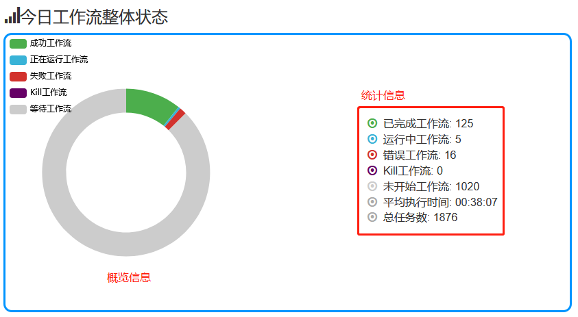

该统计图表支持动态式与用户交互：用户将鼠标光标放到其中一块工作流状态区域，该统计图表可以动态地为用户显示相应工作流状态的数目和占所有工作流的百分比。

### 4.2.2 今日工作流整体状态（详情表格）

 

该详情表格为用户列出了工作流的今日状态基本信息，譬如：运行成功数目和运行失败数目等。

### 4.2.3 异常工作流实时信息

 

该实时信息表为用户列出了一些工作流的非手动异常信息，包括：KILLED，FAILED 和 FAILED_FINISHING

## 4.3 项目页

项目由工作流集合组成，对项目的操作其实就是对其底下工作流的操作。

 

项目页包含快速查找（根据项目名，描述，创建用户包含）、项目名排序、新建项目和项目列表四个部分。项目列表又分为个人项目列表和所有项目列表。

### 4.3.1 项目工具栏

 

### 4.3.2个人项目

 

### 4.3.3 所有项目

 

该所有项目列表将登陆用户所拥有可读权限的所有项目全部列出。

## 4.4 定时调度页

 

定时调度页包含定时调度工作流列表，列表中展示的信息包含工作流 ID、工作流名称、所属项目、提交人、调度配置修改时间、下一次执行时间、Cron 表达式、工作流是否有效、是否设置告警等信息。提供快速查找（根据工作流名称、所属项目名称或提交人）、按列排序、显示参数、删除调度、设置告警和调度配置等操作。

 
 
- 显示参数：以 JSON 字符串方式显示工作流设定的定时调度参数
- 设置告警选项：用来对定时调度工作流的子工作流/任务进行超时告警或者事件告警规则设置。（详情请参考 5.6.1）
- 调度配置选项：用来对工作流的定时调度参数重新配置。（详情请参考 5.5）

## 4.5 正在运行页

 
 
正在运行页包含三个子页面，分别是当前运行工作流列表、最近完成工作流列表和循环执行工作流列表，并且对正在执行的工作流状态支持实时刷新功能。

### 4.5.1 当前运行工作流列表

 
 
当前运行工作流列表的每一行都列出了当前正在单次运行的工作流运行状态以及相应的基本信息，具体请参考上图。
 
当前运行工作流列表支持按列排序和手动结束正在运行的工作流。
1. 通过点击执行 Id 可链接到工作流视图，工作流的任务列表，工作流日志以及运行参数。（详情请参考 5.7）
2. 通过点击工作流名称可链接到工作流视图，工作流执行历史以及执行摘要。（详情请参考 5.7）
3. 通过点击项目名称可链接到工作流归属的项目视图。(详情请参考 5.3)

### 4.5.2 最近完成工作流列表

 
 
最近完成工作流列表的每一行都列出了最近完成的单次运行和循环执行的工作流的基本信息，具体请参考上图。

### 4.5.3 循环执行工作流列表

 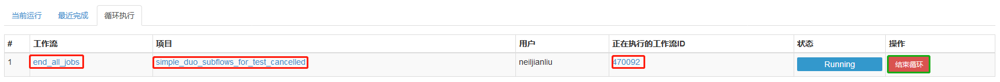

循环执行工作流列表支持手动结束正在循环运行的工作流操作。

## 4.6 执行历史页

 

执行历史页中列出了所有工作流的执行历史记录。支持对列表进行按列排序、快速查找（根据执行 Id ，工作流名称或者项目名称）、通过输入更详细的信息进行高级过滤等操作。

### 4.6.1 工作流执行历史记录列表

 

工作流执行历史记录列表每一行都列出了工作流的运行状态，执行类型以及相应的基本信息。
 
### 4.6.2 执行历史高级过滤
 
 
 
## 4.7 用户参数页

 

用户参数页包含用户参数列表，支持新增用户参数、修改已有用户参数操作。

 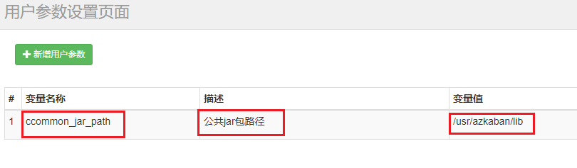

 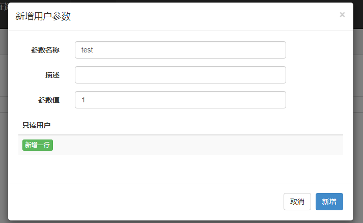
 
此功能模块实现了一个用户级别的静态全局变量，避免了用户每次修改参数时都得手动更改项目文件脚本，再次上传项目文件和发版。此变量只有变量拥有者可以编辑，变量拥有者可以分享变量给其他用户使用(只读)。

**变量作用域：**
变量创建者拥有读写权限，授权用户具有可读权限

**变量优先级：**
工作流动态全局变量 > 系统临时全局参数 > properties 参数配置文件 > 用户级别静态全局变量（本次需求） > 系统默认值    （properties 参数配置文件请参考 5.2.3， 系统临时全局参数请参考 5.4.6，工作流动态全局变量请参考 5.4.6.1）

**变量作用时效：**
工作流启动时候生效，如果修改了变量值，下次执行生效

**注意事项：**
- 用户在 Job 脚本文件内引入全局变量，格式为 ${KEY}， Schedulis 在执行此脚本的时候会将全局变量替换为其对应的值，注意一定要有对应的读权限，否则 Schedulis 将不能解析此变量，会把 ${KEY} 当成字符串解析。
- 不能在 .job 文件的 type，user.to.proxy，dependencies 属性中引用全局变量，如 type=${abc}。
- 不能在 .sh，.py， .hql， .sql 等脚本文件中引用全局变量

## 4.8 系统管理页

 

系统管理页需要管理员权限才可以使用。系统管理页包含用户管理、部门管理、资源分组管理这三个子页面，提供快速查找（根据用户名包含，部门名包含）、新增用户、修改已有用户、新增部门、修改已有部门、新增资源分组、修改已有资源分组等功能。

### 4.8.1 用户管理

 
 
用户管理子页支持根据用户名包含进行快速查找、新增用户和修改已有用户功能。
用户信息中，包含了用户角色：普通用户和管理员、用户种类：系统用户和实名用户。

### 4.8.2 部门管理

 
 
部门管理子页支持根据部门名称包含进行快速查找、新增部门和修改已有部门功能。
**注意：** 须将部门分配到相应的资源分组中。

### 4.8.3 资源分组管理

 

资源分组管理子页支持新增分组和修改已有分组功能。

#### 4.8.3.1 多租户方案

**背景：**
资源分组管理其实就是系统的多租户管理方案，此方案旨在将集群中的执行节点根据资源分组列表，实现租户之间资源不互通的物理隔离，用户可以根据该租户的批量情况，自由地将租户分配到某个合适的资源分组中。以此来避免这样一个场景：某一用户的批量将集群资源占满，导致其他用户无法提交任务。

**使用说明：**
- 在系统管理功能模块的资源分组管理子页中，点击新增资源分组，即可按照用户意愿新增一个物理隔离的资源组，用户可以自由决定将指定的执行节点划分到这个资源分组中。
- 在部门管理子页中，用户可以根据该部门的业务批量数量以及所占资源大小，将该部门分配到一个已创建的资源分组中。
- 在该部门底下的所有用户所提交的全部工作流，会只在这个资源分组中被执行。
- 对于一个资源分组中的用户所提交的工作流，Schedulis 系统使用负载均衡算法，将该工作流分配到所属资源分组中最优的执行节点去执行。


# 5 使用说明

**注意：请在 Chrome 浏览器中操作使用 Schedulis 系统。**

## 5.1 创建项目

点击导航栏项目选项，即可跳转到项目功能模块。（详情请参考 4.3）
创建项目是第一步，只有先在界面上创建了项目，才可以上传开发好的工作流 ZIP 包。创建项目时必须填写项目名称和项目描述。

 

 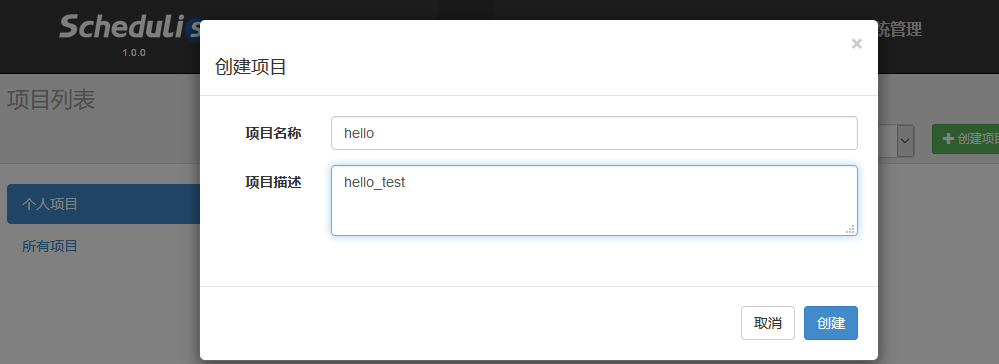

项目创建完毕之后会直接跳转到项目的详情页面。项目详情页面包含工作流列表、权限列表、项目操作记录列表；支持上传项目文件、下载项目文件、删除项目等操作；对于整个项目，支持定时调度所有工作流、立即执行所有工作流和折叠/展开工作流列表等操作。

### 5.1.1 项目基本信息

 

## 5.2 开发项目

一个项目底下可以有多个工作流，一个工作流底下可以有多个子工作流和多个任务，一个任务包含一个 .job 文件，即任务描述文件，以及一个可选的 .properties 文件，即参数配置文件。最终将所有的文件和文件夹放在同一个文件夹底下，打包成一个 ZIP 包，进行上传，便成功开发了一个项目。
项目的总体开发过程分为以下几个步骤：
- 新建项目文件夹
- 创建任务文件
- 创建参数配置文件（可选）
- 打包成一个 ZIP 包
- 将 ZIP 包上传到 Schedulis 系统

### 5.2.1 新建项目文件夹

用户在本地电脑的硬盘中新建一个文件夹，文件夹可以自由命名。进入文件夹，在文件夹中开发任务文件，或者根据用户逻辑再创建子文件夹，在子文件夹底下开发任务文件。

### 5.2.2 创建任务文件

任务文件为普通的文本文件，以 .job 为文件的后缀。可以使用任意文本编辑器进行编辑，例如：Sublime Text、Notepad++ 等常见的文本编辑器。支持中文，推荐使用 UFT-8 编码格式进行编辑。任务文件的内容为一行行的 KEY=VALUE 配置，以一个普通的 EventChecker 任务为例，.job 任务描述文件的内容如下图所示：

 

### 5.2.3 创建参数配置文件

在一个工作流中，.job 文件或者 Job 的脚本文件，例如：SQL、Python 等文件中往往需要使用一些参数。Schedulis 支持以文件形式进行参数配置，参数配置文件为普通的文本文件，以 .properties 为后缀，在配置文件中以 KEY=VALUE 的形式配置参数。

关于配置文件的可读问题：
- 任务描述文件可以读取同一级别目录以及父目录的参数配置文件。
- 任务描述文件不可以读取其子目录下的参数配置文件。

 

用户可以在 .job 文件中引用配置的参数，也可以在 SQL、Python 等脚本中使用同样的方式引用配置参数。例子中的 ${name} 会在任务执行前被替换成 zhangsan 。

 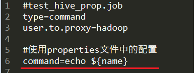

不同的配置文件或者同一份配置文件会存在配置相同的 KEY 的情况，这些配置是存在优先级区分的。同名的 KEY 的优先级规则：
- 同一配置文件中，存在相同的 KEY 配置，后配置的覆盖先配置的。

 

- 同一目录不同配置文件，存在相同的 KEY 配置，后加载的配置文件覆盖先加载的配置文件（配置文件按照字典序由小到大加载）
- 不同目录不同配置文件，存在相同的 KEY 配置，子目录的配置文件会覆盖父目录的配置文件

 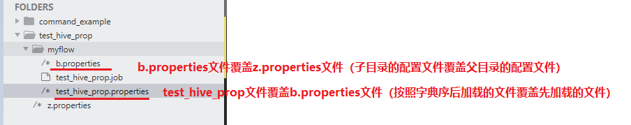

- 在调度或者执行工作流的界面上也可以配置参数，在该界面上配置的参数具有更高优先级，会覆盖掉 .properties 文件中的同名配置参数。
- 参数配置优先级：工作流动态全局变量 > 系统临时全局参数 > properties 参数配置文件（本次需求） > 用户级别静态全局变量 > 系统默认值    （系统临时全局参数请参考 5.4.6，工作流动态全局变量请参考 5.4.6.1）

除了用户自定义的参数，目前 Schedulis 抽象出了一套内置的时间参数供业务使用，具体参数列表参看附录中的 Schedulis 内置参数列表。

### 5.2.4 打包项目文件夹

项目文件编辑完成之后，需要把项目中涉及的所有文件打包到一个 ZIP 压缩包之中。(文件的相互引用需保证相对路径的正确性)

### 5.2.5 上传项目

在已经创建好的项目页中，点击上传项目按钮，选择开发好的项目 ZIP 包，完成上传项目。

 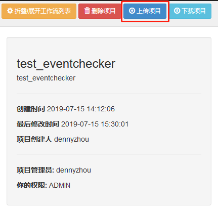
 
## 5.3 项目视图

项目上传完成之后，会跳转到项目详情页面，分为工作流列表、权限列表、项目操作记录三个子页。

### 5.3.1 工作流规则

一个工作流是子工作流和任务的集合。这些任务和子工作流可以相互关联组成 DAG (Directed Acyclic Graph)，其中 DAG 末端节点的名称即为该工作流的名称。任务之间的依赖关系通过 Job 描述文件中的 dependencies 属性来定义，如 5.2.2 中 test\_eventchecker\_receive 任务依赖的任务是 test\_eventchecker\_send 任务，这两个任务组成一个工作流。test\_eventchecker\_send 任务的配置如下图所示：

 

在 test\_eventchecker\_send 任务中没有再依赖其它的任务。由此可知这个工作流只由两个任务组成，其中 test\_eventchecker\_send 为上游任务，test\_eventchecker\_receive 为下游任务。所以工作流的名字以末端任务名字命名，为：test\_eventchecker\_receive。工作流的血缘图如下所示：

 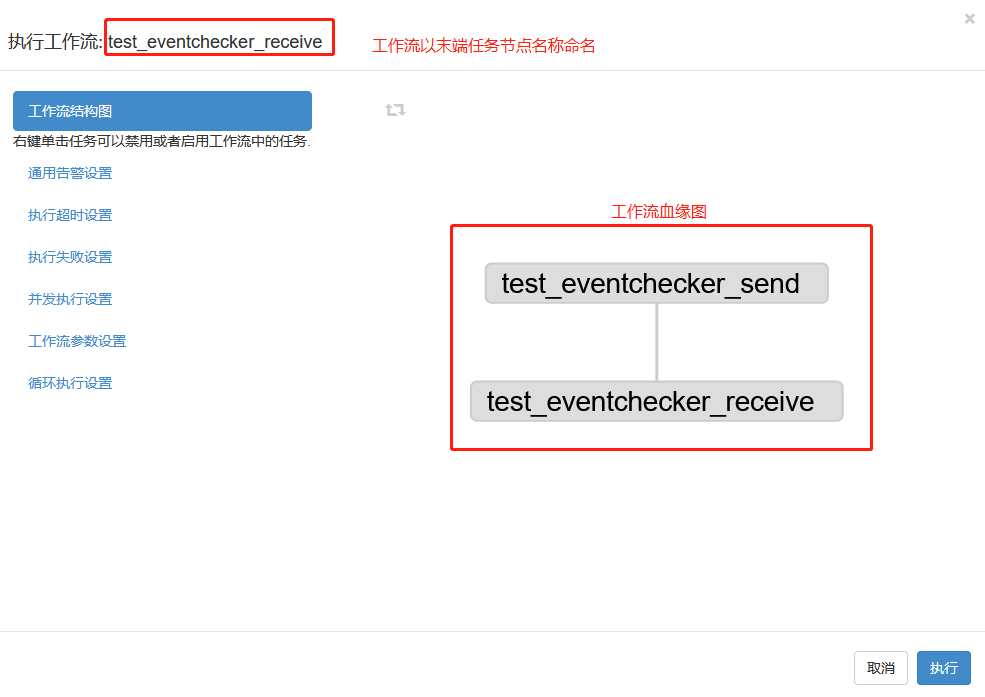

### 5.3.2 工作流列表


 
 可展开工作流下的所有任务列表
 
 
 
 对于每个工作流，可以对之执行定时调度、立即执行和查看执行历史操作。对于工作流下面的任务列表，可以对每一个任务执行定时调度、立即执行、依赖运行和查看执行历史操作。

### 5.3.3 权限列表

对于项目，Schedulis 包含3个角色和5种权限。3个角色分别为：项目管理员、项目用户和代理用户。5个权限分别为：管理权限、读权限、写权限、执行权限和调度权限。

 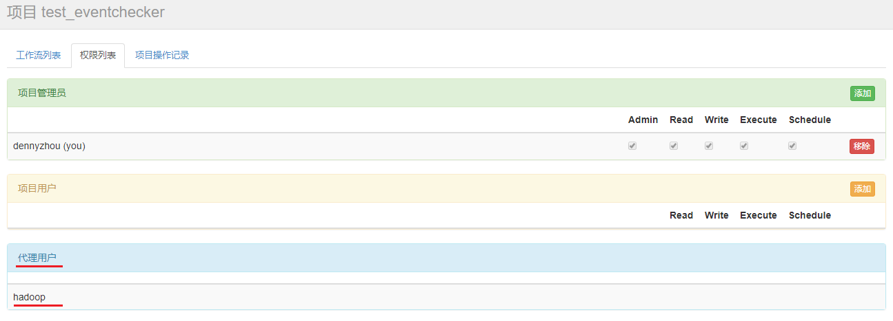

- 如果是项目管理员, 则拥有操作该项目的所有权限(管理，读，写，执行，调度)。
- 项目管理员可以为项目添加项目用户，并为之分配权限，同时可以修改已有项目用户的权限，删除已有项目用户。
- 项目管理员还可以添加新的项目管理员和移除已有的项目管理员。

**权限列表的中的代理用户非常重要，在执行任务的时候需要用到代理用户，即后台实际执行任务的用户** 。 **（注意：代理用户配置之后需要重新登录之后才能生效）**

### 5.3.4 项目操作记录

 
 该页面列出了该项目的所有操作记录，并支持实时刷新项目操作。

## 5.4 执行工作流


在执行工作流的视窗中可以查看工作流结构图，对工作流进行通用告警设置、执行超时设置、执行失败设置、并发执行设置、工作流参数设置和循环执行等操作，然后点击执行按钮，触发工作流立即执行；也可选择使用系统默认参数，直接点击执行按钮，使工作流一键执行。

### 5.4.1 工作流结构图

 
 
用户可以选择手动对工作流进行设置，或者使用系统默认设置。

对于工作流结构图中的每个节点，用户可以通过右键点击选定的节点，手动地对其进行一系列操作：

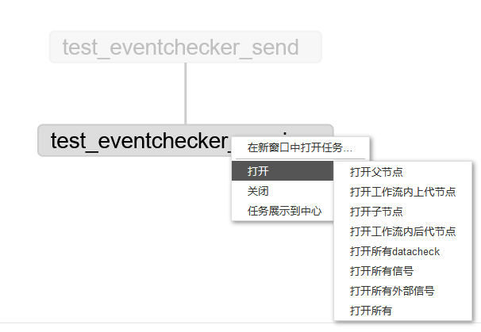

### 5.4.2 通用告警设置

通用告警设置可以分为两种：工作流执行失败告警设置和工作流执行成功告警设置。

#### 5.4.2.1 工作流执行失败告警

工作流执行失败告警可以设置的告警策略，目前有两种：一种是在工作流中某一个任务失败的时候立即触发告警；另一种是在所有正在执行的工作流完成之后再触发告警。可以自由选择告警策略，设置告警级别，填写告警通知的用户列表。系统会根据告警的级别以邮件、通讯消息、电话等多种方式通知用户。

 
 
#### 5.4.2.2 工作流执行成功告警
 
工作流执行成功时可以自由选择是否告警，设置告警级别，填写告警通知的用户列表。具体告警级别相对应的告警方式，请参考附录 7.2 告警级别与对应通知方式参照表

 

### 5.4.3 执行超时设置

 
 
单次执行工作流支持设置超时告警，用户可以自由选择当工作流没有在指定的执行时间内完成，是否选择触发超时告警。
告警规则分为：SUCCESS 和 FINISH，即工作流是否在指定时间内成功或者结束。用户指定超时时间，告警级别，根据需求选择发送超时告警邮件（填上告警邮件地址）或者终止工作流。
超时时间的格式是 HH:MM，单位是小时和分钟，例如18分钟任务还未完成触发超时告警，时间格式为 00:18。

### 5.4.4 执行失败设置

可以在该页面设置一些工作流执行失败时的策略：完成当前正在运行的任务、结束正在执行的任务和完成所有可以执行的任务。
另外，用户还可以对一些指定的任务（可以是全部任务列表）或者子工作流，进行失败重跑设置和失败跳过设置。
当系统已经完成了用户设置的失败重跑以及失败跳过操作后，工作流仍然处于执行失败状态的，系统就会根据用户选择的三个失败策略中的一个，进行相应的后续操作。

 
 

### 5.4.5 并发执行配置

可以在该页面配置策略来处理重新提交的同名工作流，在上一次提交的工作流未运行完成时，对于新一次提交的同名工作流，并发执行策略包含跳过执行、同时运行和设置管道，管道还可以分为 Level 1 和 Level 2 等级。

 

除了按照系统默认的工作流并发度来运行工作流之外，用户还可以按照自己的设计来控制工作流中的 Job 并发数目。可以在工作流参数设置里面（详情请参考 5.4.6），添加参数 flow.num.job.threads 。例如设置10个并发作业度：

 

### 5.4.6 工作流参数配置

在该页面可以设置工作流的临时全局参数，该参数会覆盖项目包中 properties 参数配置文件中的 KEY 值相同的参数。

 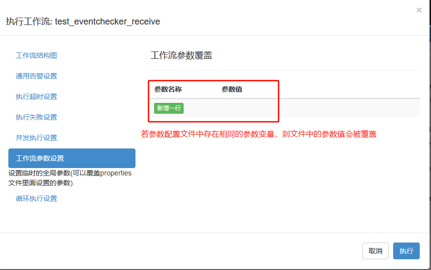
 
参数配置优先级：工作流动态全局变量 > 系统临时全局参数（本次需求） > properties 参数配置文件 > 用户级别静态全局变量 > 系统默认值    （工作流动态全局变量请参考 5.4.6.1）

#### 5.4.6.1 工作流动态全局变量参数设置

Schedulis 支持基于工作流级别的动态全局变量，可以让工作流运行参数可以直接被工作流中的任意一个 Job 引用。
用户在 Shell 脚本内将一个关于动态参数的 JSON 串写入 JOB\_OUTPUT\_PROP\_FILE，后续的 Job 就可以在 .job 文件内直接使用 ${KEY} 来读取 JSON 中相对应参数的值。（ KEY 需与 JSON 中的变量名相匹配）

以下是一个使用工作流动态全局变量的例子：

1. 书写一个 Command 类型的 Job(test.job)，此 Job 执行一个 test.sh 脚本

 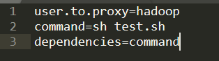

2. 将一个关于动态变量的 JSON 写入 JOB\_OUTPUT\_PROP\_FILE ，注意动态变量的 KEY 必须以 all\_ 开头

 

3. 书写一个依赖 Job，读取之前的动态变量值

 
 
参数配置优先级：工作流动态全局变量（本次需求） > 系统临时全局参数 > properties 参数配置文件 > 用户级别静态全局变量 > 系统默认值    
 
#### 5.4.6.2 工作流动态全局变量支持局部范围生效

Schedulis 提供一个参数 ns_wtss (该参数可通过任何途径设置，比如执行临时参数，properties 参数配置文件，用户参数等) ，此参数默认为 true，表示参数为全局参数；如果设置此参数为 false，表示此参数不再是全局变量，而是只对依赖的下一级 Job 生效。

例如：

1. 在 .properties 文件中设置参数 ns_wtss 为 false

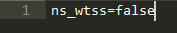

2. 将关于动态参数的 JSON 写入 JOB\_OUTPUT\_PROP\_FILE


此时的 all_mycontent 动态变量并非全局范围生效，该变量只能对依赖的下一级 Job 生效。

### 5.4.7 循环执行设置

循环执行设置可以在一次工作流结束后，立即开始下一次的执行，并且需要带上上一次执行的相关参数。    
该功能主要适用于这样的场景：业务团队在开发工作流时有需要在一次执行结束之后立即进行下一次任务，而每一次任务的执行时长是不确定的，没办法设置固定时间拉起下一次任务。    
用户可以对循环执行错误时选择失败策略：终止循环执行流程或者继续执行循环执行流程。    
此外，用户可以在页面上手动终止循环执行的工作流。当循环执行中断时，可以选择告警级别以及告警人列表。


## 5.5 定时调度工作流


在定时调度工作流的视窗中可以查看工作流结构图、对工作流进行通用告警设置、执行失败设置、并发执行设置、任务跳过时间设置、工作流参数设置和定时调度等操作，点击执行调度按钮，触发调度任务的提交；也可选择使用系统默认参数，直接点击执行按钮，使工作流一键调度。

### 5.5.1 工作流结构图

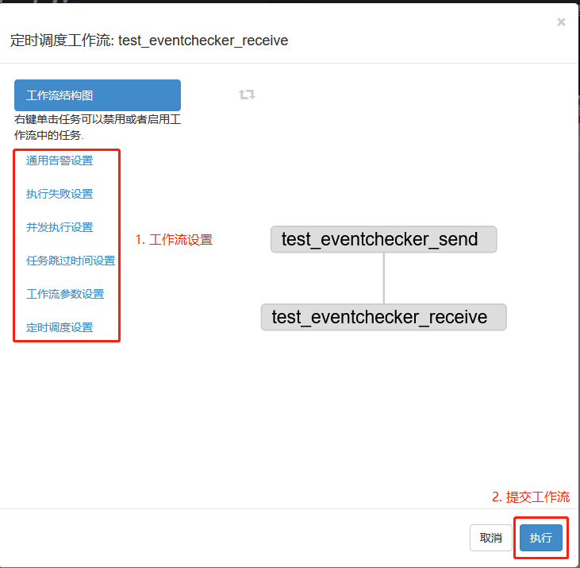

### 5.5.2 通用告警设置

通用告警设置可以分为两种：工作流执行失败告警设置和工作流执行成功告警设置。

#### 5.5.2.1 工作流执行失败告警

 
 
（详情请参考 5.4.2.1）
 
#### 5.5.2.2 工作流执行成功告警
 
 
 
（详情请参考 5.4.2.2）

### 5.5.3 执行失败设置

 
 


（详情请参考 5.4.4）

### 5.5.4 并发执行设置

 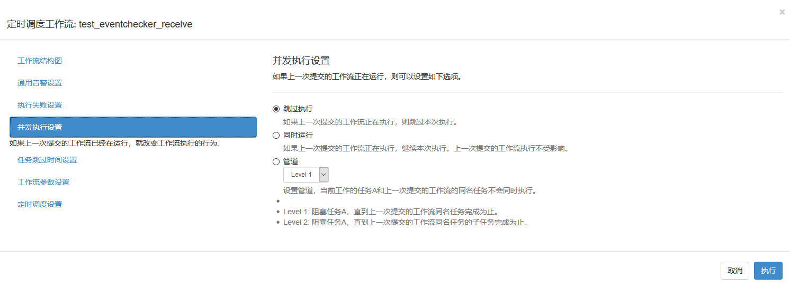

（详情请参考 5.4.5）

### 5.5.5 任务跳过时间设置

在定时调度的工作流中，为一些 Job 提供 Cron 表达式，如果定时调度工作流的提交时间和指定 Job 的 Cron 时间一致（只精确到年月日），该 Job 就会被跳过执行。

- 适用场景：

适用于某些场景下，用户需要定时调度作业流中的某些 Job 在指定日期不执行。

- 使用说明：

选择要跳过执行的 Job，输入正确的 Cron 表达式（只精确到年月日），当 Cron 表达式输入正确后，页面会展示 TOP 10 时间，否则表示 Cron 表达式输入有误。

 

### 5.5.6 工作流参数设置

 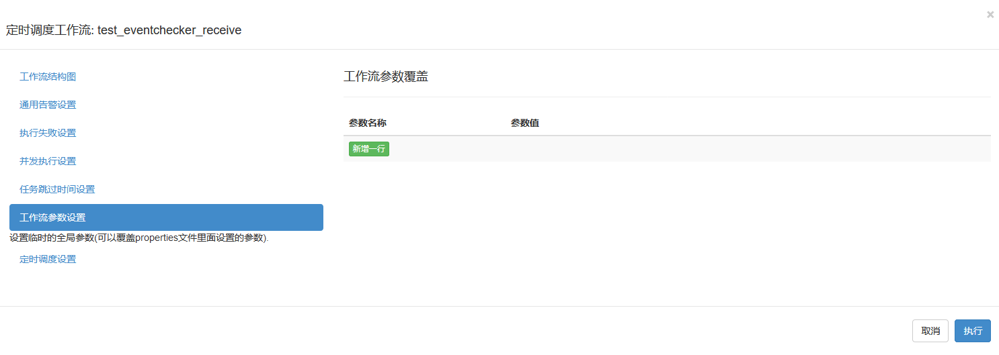

（详情请参考 5.4.6）

### 5.5.7 定时调度设置

定时调度以 Asia/Shanghai 为参考时区，以 Quartz 的 Cron 表达式来设置定时任务的调度时间。当 Cron 表达式输入正确后，页面会展示 TOP 10 时间，否则表示 Cron 表达式输入有误。

 

Cron 表达式的使用说明可以参考如下链接：

[http://www.quartz-scheduler.org/documentation/quartz-2.3.0/tutorials/tutorial-lesson-06.html](http://www.quartz-scheduler.org/documentation/quartz-2.3.0/tutorials/tutorial-lesson-06.html)

## 5.6 子工作流/任务的运行与调度

对于工作流底下的子工作流和任务列表，Schedulis 系统支持对用户选定的子工作流/任务，进行定时调度、运行任务（立即执行）、依赖运行和查看执行历史功能。
定时调度，立即执行以及查看执行历史的操作，其逻辑与对工作流的操作类似，在此就不再描述。
至于子工作流/任务的依赖运行，即是对与用户选定的节点有上下级依赖关系的一系列子工作流/任务集合，进行立即执行操作。

 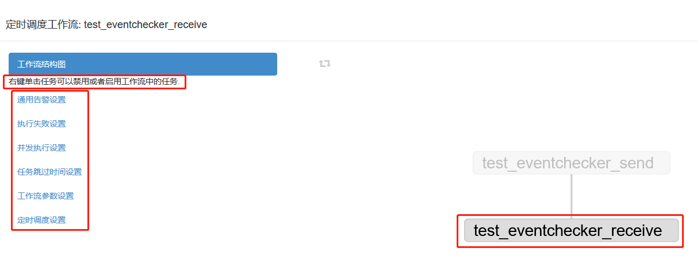

### 5.6.1 子工作流的告警设置

对于定时调度的工作流，用户可以对该工作流下的子工作流/任务进行告警设置
 
**使用说明：导航栏上的定时调度 >> 设置告警选项**
**支持告警策略：**

- 子工作流/任务超时告警（具体操作详情请参考 5.4.3）

- 子工作流/任务事件规则告警：

 
 
用户自由选择需要告警的子工作流/任务、告警规则：SUCCESS / FAILURE / FINISH、告警级别：INFO / MINOR / WARNING / CRITICAL / MAJOR / CLEAR，来设置触发子工作流/任务的告警事件。

### 5.6.2 子工作流的条件执行

**适用场景：**
- 支持根据运行时的动态参数触发任务执行；
- 支持通过父辈任务节点的状态触发子任务节点执行。

**使用说明：**
如果某个任务需要按条件触发执行，需要进行如下设置：
1. 任务的触发条件在 YAML 文件中通过 condition 字段描述，而且属于 Job 级别的属性字段；
2. 设置 condition 字段的任务只有在执行条件满足的时候才会触发执行，否则会被跳过。

当任务是根据父辈节点运行时的动态参数触发执行时：
- 可以通过表达式组合不同上游 Job 产生的运行时参数，目前支持如下运算符：
    - 比较运算符：==， !=， >， >=， <， <=
    - 逻辑运算符：&&， ||， !
- 可以通过 “${}” 进行变量替换；
- 可以使用 “:” 来指定当前 Job 要使用的运行时参数由哪个 Job 产生(设置参数的命名空间)，将运行时参数和产生参数的 Job 绑定；
- 处于子工作流 (EmbeddedFlow) 中的 Job 只能引用属于同一个子工作流中 Job 产生的运行时参数。

示例 1：
JobC 依赖 JobA 产生的参数 param1 和 JobB 产生的参数 param2，JobC condition 字段中的表达式引用这两个参数运算结果为 TRUE 的时候 JobC 才会触发执行。
- conditional_workflow1.flow
```
nodes:
 - name: JobA
   type: command
   config:
     command: bash ./write_to_props1.sh 
 - name: JobB
   type: command
   config:
     command: bash ./write_to_props2.sh 
 - name: JobC
   type: command
   dependsOn:
     - JobA
     - JobB
   config:
     command: echo “This is JobC.”
   condition: ${JobA:param1} == 1 && ${JobB:param2} > 5
```
- write\_to\_props1.sh
```
echo {"param1":"1"} > $JOB_OUTPUT_PROP_FILE
```
- write\_to\_props2.sh
```
echo {"param2":"6"} > $JOB_OUTPUT_PROP_FILE
```

当任务是通过获取父辈任务节点的状态触发执行时：
- 目前设置了如下几个宏变量描述父辈任务节点:
    - all_success，默认的状态，即父辈所有节点都执行成功；
    - all_failed，即父辈所有节点都执行失败；
    - all_done，即父辈所有节点都执行完成(成功、失败或者被跳过)；
    - one_failed，即父辈所有节点都执行完成且至少有一个节点执行失败；
    - one_success，即父辈所有节点都执行完成且至少有一个节点执行成功。
    
- condition 字段可以直接引用上面定义的宏变量。

示例 2：
JobA 运行成功之后触发 JobB 执行，JobA 运行失败之后触发 JobC 执行， JobB 或者 JobC 执行成功触发 JobD 执行。
- conditional_workflow2.flow
```
nodes:
 - name: JobA
   type: command
   config:
     command: pwd
 - name: JobB
   type: command
   dependsOn:
     - JobA
   config:
     command: echo “This is JobB.”
   condition: all_success
 - name: JobC
   type: command
   dependsOn:
     - JobA
   config:
     command: echo “This is JobC.”
   condition: all_failed
 - name: JobD
   type: command
   dependsOn:
     - JobB
     - JobC
   config:
     command: pwd
   condition: one_success
```
**场景描述：**
- 默认情况下，如果没有设置 condition 字段，所有任务的执行条件都是：all\_success。用户上传项目 ZIP 包的时候，系统会检测 YAML 文件中是否有定义 condition 字段，如果有 Job 没有设置 condition 字段，默认该字段会被设置为 all\_success。如果在工作流运行的过程中，用户强制杀死了工作流，这个时候所有正在执行的任务都被杀死，同时会无视所有未执行任务设置的执行条件，没有执行的任务都会被跳过执行。
- 如果一个任务的运行失败，它的子节点 condition 字段设置了除 all\_success 之外的某个宏变量，这时 Flow 不会被设置为失败，其他可以运行的任务将会继续运行到不能再触发其他节点为止。
- 即使某些 Job 运行失败了，Flow 的状态可能也会标记为成功。例如：如果 JobC 的触发条件是 JobA 和 JobB 中一个执行成功就触发，假设 JobA 执行成功，JobB 执行失败，这个时候 JobC 会被触发，此时 Flow 还是会被认为会成功运行完成。
- 如果一个任务的执行条件判断没有通过，这个节点将会被跳过，而且这个节点所有的后代节点都被跳过执行，也就是这个节点所开头的所有下游路径会被取消执行。如果用户这个时候只想跳过这个执行条件判断不通过的节点而不跳过执行下游的后代节点，这个时候可以在该节点的子节点增加宏变量来做处理。
- 在做执行条件判断之前会做执行条件参数的检查，用户执行应用系统已经设置的宏变量。对于动态参数用户只能引用相同 Flow 内其他 Job 产生的动态参数，哪怕这个 Job 跟引用它产生的动态的 Job 不在同一条执行路径。用户必须自己保证执行条件的逻辑正确，例如：父节点不应该引用子节点的动态参数。
- 对于一个 Flow 的起始节点不应该设置执行条件，否则这个 Flow 可能永远不能启动。
- 用户可以同时使用动态运行参数和任务执行状态两种执行条件组合一个大的执行条件表达式，例如：condition: one\_success && ${JobA:param1} == 1，但是同一个 Job 的 condition 字段只能引用一个宏变量，因为宏变量被系统认定是互斥的。如果用户只在 condition 设置了动态参数作为执行条件表达式，这个时候系统默认认为这个 Job 的执行条件引用了宏变量 all\_success。

**注意：**
- 只支持父辈的状态或者传入的参数触发条件执行任务，不支持直接获取更高层祖先节点的执行状态或者动态运行参数；
- 只支持同一个 Flow 内的动态参数获取，EmbeddedFlow 不能获取上层 Flow 的动态参数；
- 如果设置了条件执行参数(按依赖父节点状态触发执行)，一旦有父节点任务执行失败，Flow 不会马上标记为失败，必须所有父节点执行完才能确定。

## 5.7 任务详情

在导航栏的定时调度功能模块中可以查询所有的定时调度工作流；
在导航栏的正在运行功能模块中可以查询：正在运行的工作流、最近完成的单次运行的工作流；
在导航栏的执行历史功能模块中可以查询所有的工作流执行状态。


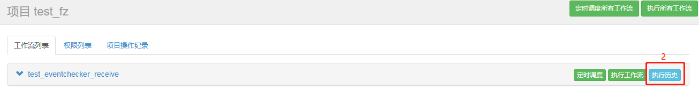

在这些页面中，用户都可以通过一下操作查看相应的信息：
1. 通过点击执行 Id 可链接到工作流视图，工作流的任务列表，工作流日志以及运行参数。
2. 通过点击工作流名称或者项目视图中的执行历史选项可链接到工作流视图，工作流执行历史以及执行摘要。
3. 通过点击项目名称可链接到工作流归属的项目视图。（详情请参考 5.3）

### 5.7.1 工作流视图

工作流视图可以用来表现整体工作流的执行情况，灰色的表示未执行的任务、绿色的表示执行成功的任务、蓝色表示正在执行的任务、红色表示执行失败的任务。

 

### 5.7.2 任务列表

 

任务列表页面中列出了已经执行结束的任务（包括成功或者失败）和正在执行的任务列表。可以查看单个任务的执行详细信息，譬如执行时长，也可以查看或下载单个任务的执行日志。
也可以通过点击任务名称，查看以图表和表格的形式显示的单个任务运行状况。

 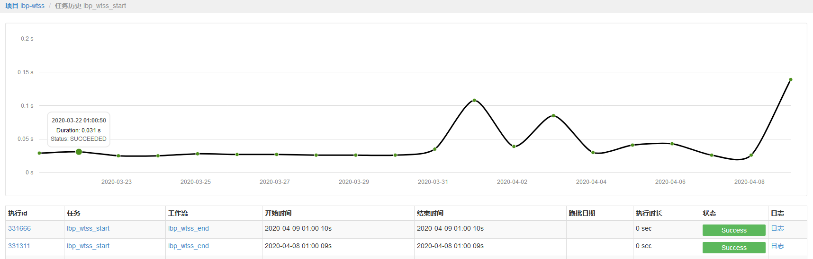

### 5.7.3 工作流日志

在工作流日志页面可以查工作流的执行日志，对于正在运行的任务也可以实时刷新该工作流的执行日志或者手动结束该工作流。

 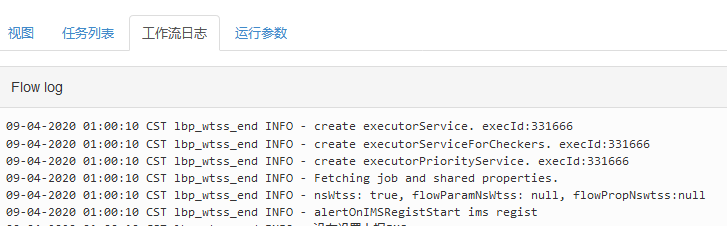
 
### 5.7.4 工作流运行参数

 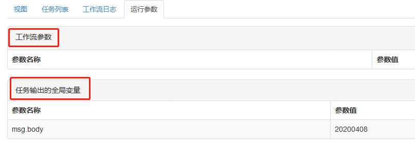
 
用户可以通过这个页面，查看工作流的临时系统参数以及工作流运行时输出的动态全局变量。

### 5.7.5 工作流图表

工作流图表和工作流视图类似，都是工作流的 DAG 图，和工作流视图不同的是，工作流图表只描述了任务之间的依赖关系，没有任务的执行状态。

 
 
### 5.7.6 执行历史
 
执行历史页面，以图表和表格的形式，显示出了工作流的运行状况。

 
 
### 5.7.7 任务摘要

工作流摘要页面列出了工作流的摘要信息。

 
 
# 6 Job 任务类型
 
## 6.1 Command 任务

### 6.1.1 需求背景

用户需要以命令行的方式执行或调度一些任务。

### 6.1.2 使用场景

Command 任务是一种基础任务，Command 任务可以用来描述基础的 Shell 脚本、HQL 文件、Python 文件等任何使用命令行执行的任务。

### 6.1.3 配置方法

**Command Shell 类型的任务介绍：**
Command 作业类型是基本的内置类型之一。它使用 Java ProcessBuilder 运行多个 UNIX 命令。在执行过程中，Azkaban 会产生一个运行该命令的过程。

**Command Shell 任务类型的描述文件如下所示：**

```
# type 标示了任务类型为:command，表明任务可以使用命令行执行
type=command

# dependencies 表示当前 Job 所依赖的 Job 名称
dependencies=jobName

# user.to.proxy 标示代理用户，即后台真正执行任务的用户。如果不设置，默认的执行用户为当前登录用户。
user.to.proxy=systemUser

# command 标示执行语句，如有多条执行语句，第二条语句从 command.1 开始
# ‘script/’ 是和任务描述文件在同一级目录的子文件夹
command=do something
command.1=hive -e "show tables;"
command.2=hive -f "script/hive.sql"
command.3=spark -f "script/spark.sql"
…
command.n=sh script/script.sh
```

---

**示例：**

hello1.job

```
type=command
command=echo "This is hello1 job."
```

hello2.job

```
type=command
command=echo "This is hello2 job."
dependencies=hello1
```

将所有 Job 资源文件打包到一个 ZIP 包中，这样一个 Command 类型的 Job 就做好了。

## 6.2	DataChecker 任务

### 6.2.1	需求背景

用户在执行定时 ETL 任务的时候，希望上游的输入表的数据是准备好的，避免定时任务启动之后出现空跑或者在输入数据不齐全的情况下触发定时任务的执行。

### 6.2.2	使用场景

当需要确定上游数据准备好了之后，再触发定时任务执行时，可以使用 DataChecker 任务对上游数据进行检查，确保数据 OK 之后，再触发下游任务执行。

### 6.2.3	配置方法

**DataChecker 任务概述：**

DataChecker 任务类型用来判断第三方系统接口地址同步的数据，或者其他运行的 Job 生成的数据是否已经准备好。

**DataChecker source.type 类型详解：**

source.type 类型|  检查的数据源
---|---
bdp|  第三方系统接口地址数据，依赖于mask数据脱敏项目，暂时不开放使用
job|  Hive Metastore
   
- 当source.type 类型为 job 时，会直接查询 Hive Metastore；当 source.type 类型为 bdp 时，支持第三方系统接口地址查询数据状态
- DataChecker 的 job 类型只能保证 Hive 表的元数据是否写入完成，不能保证数据的完整性。

**DataChecker 任务的描述文件示例如下：**

Parameter | Description
---|---
type | 	规定为 datachecker
user.to.proxy | 标示后台真正执行任务的用户，如果不设置默认的执行用户为当前登录用户
source.type	 | 依赖的数据来源，job 表示是由其他 Job 产生，bdp 表示第三方系统接口地址的数据
data.object  | 依赖数据的名称例如：data.object.1=dbname.tablename{partitionlist}
wait.time | 描述任务的等待时间，单位是小时
query.frequency | 描述查询频率，例如设置的查询频率是 10，等待时间是1个小时，该 Job 会在一个小时之内查询 10 次看依赖的数据是否准备好
time.scape | 描述依赖数据生成的时间范围，单位是小时。例如设置的查询范围是 24，那就查询最近一天之内依赖的数据是否已经生成。


**ps: source.type 中的分区信息一定要写全量信息，比如表中为二级分区，如果只写一级分区是检测不到的。**
**配置多个数据源具体格式如下：**

```
type=datachecker
source.type.1=job
data.object.1=cf_ds_ods_mask.bsp_dscs_field{ds=2016-12-15}
...
source.type.n=job
data.object.n=cf_ds_ods_mask.bsp_dscs_field{ds=2016-12-16}

n -> [1,2,3...100]
```

---

**示例：**

datecheck.job

```
type=datachecker
user.to.proxy=yourProxyUser
data.object=ad_audit_ods_mask.t_amis_plan
source.type.02=job
data.object.02=cf_risk_dw_work.customer_info_01{ds=${run_date}}
query.frequency=144
wait.time=24
```

将所有 Job 资源文件打包到一个 ZIP 包中，这样一个 DataChecker 类型的 Job 就做好了。

## 6.3 EventChecker任务

### 6.3.1 需求背景

在工作流中存在传递消息的场景，通过传递消息来实现基于事件的调度。假如需要收发外部消息，同样可以使用 EventChecker 任务。

### 6.3.2 使用场景

通过消息实现 Flow 之间的依赖；收发外部系统的消息。

### 6.3.3 配置方法

**EventChecker 任务概述：**

EventChecker 任务类型实现了基于事件的调度，利用 Job 收发消息功能，实现了 Flow 之间的依赖，也可用于收发外部系统的消息，但需使用我们提供的客户端工具。

**EventChecker 任务的描述文件示例如下：**

**发送消息：**

Parameter | Description
---|---
type | 	规定为 eventchecker
user.to.proxy | 标示后台真正执行任务的用户，如果不设置默认的执行用户为当前登录用户
msg.type	 | 用来指定 Job 的类型，SEND 用于发送消息，RECEIVE 用于接收消息。
msg.sender  | 指定消息的发送者，需使用 SysName-ProjectName@WFName@JobName 的格式进行定义。
msg.topic | 指定消息的主题，需使用如下格式： 一级分类编码+“_”+二级分类编码+“_”+三级分类编码，各分级编码由自己的业务场景自定义。
msg.name | 指定消息名称，由用户自定义。
msg.body | 指定消息的内容，没有内容发送可以为空。


**接收消息：**

Parameter | Description
---|---
type | 	规定为 eventchecker
user.to.proxy | 标示后台真正执行任务的用户，如果不设置默认的执行用户为当前登录用户
msg.type	 | 用来指定 Job 的类型，SEND 用于发送消息，RECEIVE 用于接收消息。
msg.receiver  | 指定消息的接收者，需使用 projectname@jobname@rtxname 的格式进行定义。
msg.topic | 指定消息的主题，需使用如下格式： 一级分类编码+“_”+二级分类编码+“_”+三级分类编码，各分级编码由自己的业务场景自定义
msg.name | 指定消息名称，由用户自定义。
query.frequency | 由于接收消息使用的是主动轮询的方式，wait.time 期间的查询次数。
wait.time | 最长等待时长，以小时为单位。超过时长未接收到消息返回失败，默认一小时。
msg.savekey | 用于保存消息内容 KEY 值，单个 Flow 内多个接收 Job，需指定不同的 msg.savekey 保存消息内容，默认值为 msg.body，后续 Job 可以使用该 KEY 值获取消息内容。
msg.rece.today|如果为 true，有且只能接收 Job 启动当天发来的消息
wait.for.time|规定为一个时间点，格式为 HH:mm，如果设置了此参数，则必须到达此时间点的时候才会触发执行，而非一等到信号就开始执行，用户输入 HH:mm  系统自动按照 Job 启动时间补全为 YYYY-MM-DD HH:mm ，EventChecker 的超时失败时间点必须大于等于此时间点，否则设置无效；设置了此参数必须满足两个条件才可以执行成功，1.等到信号 2.到达此时间点
msg.after.send | 默认 false，如果为 true，有且只接收当前 RECEIVER 启动之后，上游发出的信号
---

**示例：**

eventsend.job
```
type=eventchecker
user.to.proxy=yourProxyUser
msg.type=SEND
msg.sender=aa@bb@cc
msg.topic=aa_bb_cc
msg.name=aabbcc
msg.body=${msg.mycontent}
dependencies=eventreceive
```

eventreceive.job
```
type=eventchecker
user.to.proxy=yourProxyUser
msg.type=RECEIVE
msg.receiver=aa@bb@cc
msg.topic=aa_bb_cc
msg.name=aabbcc
msg.savekey=msg.mycontent
query.frequency=432
wait.time=24
wait.for.time=15：00
```

**注意：**

-  <font size=3>系统根据 Receiver, Topic, MsgName 记录消费进度，首次消费从启动时间后开始消费消息。</font>
-  <font size=3>Topic 和 MsgName 确定一个信号体。</font>
-  <font size=3>系统内消息以广播形式发送，一条消息存在多个接收者各自消费。</font>
-  <font size=3>消息为广播模式，一个 SENDER 对应多个 RECEIVER ，一条消息有且只能被一个接收者消费一次，同时也可以被多个消费者同时消费 </font>
- <font size=3>SENDER 和 RECEIVER 为一对多关系，禁止使用多对多的关系来使用 EventChecker；禁止同时启动多个 RECEIVER、Topic、MsgName 一样的 EventChecker 来消费上游顺序发来的多条内容不同的消息。</font>

将所有 Job 资源文件打到一个 ZIP 包中，这样一个 EventChecker 类型的 Job 就做好了。

**信号传递：**

如果需要将接收到的传递到后续 Job 使用，则使用 ${msg.mycontent} ，msg.mycontent 为 msg.savekey 定义的字段

```
user.to.proxy=hadoop
command=echo ${msg.mycontent}
command.1=sh test.sh ${msg.mycontent}
dependencies=eventreceive
```
test.sh
脚本接收信号内容，并传递给后续 Job 使用，通过写入  ${JOB_OUTPUT_PROP_FILE} 
```
cc=$*
echo 'cc >>' $cc
echo "{"'"mycontent"':'"'$cc'"'"}" >> ${JOB_OUTPUT_PROP_FILE}
```
最后一个 Job 可以通过 ${mycontent} 拿到传递的信号内容

```
type=command
user.to.proxy=hadoop
command=echo ${mycontent}
dependencies=savekeytest1
```

# 7 附录

## 7.1 Schedulis 内置参数列表

| 变量名 | 变量类型 | 变量含义 | 变量值举例 |
| ------ | -------- | -------- | ---------- |
| run\_date | String | 数据统计时间（支持用户自己设定，默认设置为当前时间的前一天），如今天执行昨天的数据，则为昨天的时间，格式为 yyyyMMdd | 20180129 |
| run\_date\_std | String | 数据统计时间(标准日期格式)，如今天执行昨天数据，则为昨天的时间，格式为 yyyy-MM-dd | 2018-01-29 |
| run\_month\_begin | String | 数据统计时间所在月的第一天，格式为 yyyyMMdd | 20180101 |
| run\_month\_begin\_std | String | 数据统计时间所在月的第一天(标准日期格式)，格式为 yyyy-MM-dd | 2018-01-01 |
| run\_month\_end | String | 数据统计时间所在月的最后一天，格式为 yyyyMMdd | 20180131 |
| run\_month\_end\_std | String | 数据统计时间所在月的最后一天(标准日期格式)，格式为 yyyy-MM-dd | 2018-01-31 |
| flow.dir | String | 工程所在路径 | /appcom/Install/AzkabanInstallschedulis-exec-1.4.0/executions/210267 |
| working.dir | String | 当前 Job 所在路径 | /appcom/Install/AzkabanInstall/schedulis-exec-1.4.0/executions/210267/PrintHelloWorld |

具体说明：
run\_date 核心变量定义：run\_date 支持用户自己设定，默认设置为当前系统时间的前一天。
其他衍生变量定义：后面所有的时间变量都是相对 run\_date 计算出来的，一旦 run\_date 变化，其他变量值也要跟着变化。
其他内嵌变量以外的时间获取方式：用户使用到的内嵌变量以外的时间需根据以上6个变量（两种不同的格式）计算得到,得到的时间都是相对于 run\_date。
如前一天 ${run\_date-1}、前7天 ${run\_date-7}、上个月的第一天 ${run\_month\_begin-1}、上两个月的最后一天 ${run\_month\_end-2}。
系统内置参数可以在 Python/SQL/Shell 脚本中直接通过 “${run\_date}” 这种方式引用

## 7.2 告警级别与对应通知方式参照表

| 告警级别 | 通知方式 |
| ------ | -------- |
| INFO | 邮件、微信 |
| WARNING | 邮件、微信 |
| MINOR | 邮件、微信 |
| MAJOR | 电话、邮件、微信 |
| CRITICAL | 电话、邮件、微信 |
| CLEAR | 电话、邮件、微信 |

## 7.3 作业流和任务的运行状态颜色说明

| 状态 | 状态说明 | 颜色示例 | 任务 | 子作业流 | 作业流 |
| ---- | -------- | -------- | ---- | -------- | ------ |
| READY | 准备状态1，默认的状态 | | ○ | ○ | ○ |     
| PREPARING | 准备状态2，表示作业流成功提交之后还没有执行的状态 |  | × | × | ○ |
| RUNNING | 表示任务在运行中的状态 |  | ○ | ○ | ○ |
| PAUSED | 表示暂停运行的状态 |  | × | × | ○ |
| RETRIED\_SUCCESS | 表示因为执行失败后重试才执行成功的状态 |  | ○ | × | × |
| SUCCEEDED | 表示执行成功的状态 |  | ○ | ○ | ○ |
| KILLING | 表示任务被杀死中的状态 |  | ○ | ○ | ○ |
| KILLED | 表示任务已经杀死的状态 |  | ○ | ○ | ○ |
| FAILED | 表示任务执行失败的状态 |  | ○ | ○ | ○ |
| FAILED\_WAITING | 表示任务已经执行失败在等待人工处理中的状态 |  | ○ | × | × |
| FAILED\_FINISHING | 表示任务将要失败的状态 |  | × | ○ | ○ |
| FAILED\_RETRYING | 表示任务已经失败准备重试的状态 |  | ○ | - | - |
| SKIPPED | 表示任务跳过执行的状态 |  | ○ | ○ | - |      
| FAILED\_SKIPPED | 表示任务执行失败后才会跳过执行的状态 |  | ○ | - | - |
| DISABLED | 表示任务关闭执行的状态（最终任务会由disabled变成skipped状态）|  | ○ | ○ | ○ |
| QUEUED | 表示当前没有资源执行任务，任务在队列中等候分配资源的状态 |  | ○ | × | × |
| FAILED\_SUCCEEDED | 表示任务是执行失败的，但是可以使用配置允许它是成功的状态 |  | ○ | ○ | ○ |
| CANCELLED | 表示任务取消执行的状态 |  | ○ | ○ | × |

注：○表示拥有此状态，×表示没有此状态
